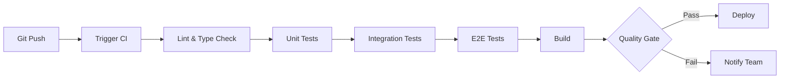

# CI/CD 流水线配置

## 功能说明

自动配置完整的 CI/CD 流水线，包括代码检查、测试、构建和部署。

## 使用方式

```bash
"配置完整 CI 流水线"
"设置 GitHub Actions"
```

## 流水线架构



## GitHub Actions 配置

### 主工作流：`.github/workflows/ci.yml`

```yaml
name: CI Pipeline

on:
  push:
    branches: [main, develop]
  pull_request:
    branches: [main, develop]

env:
  NODE_VERSION: '20'
  PNPM_VERSION: '10'

jobs:
  lint-and-type-check:
    name: Lint & Type Check
    runs-on: ubuntu-latest
    steps:
      - uses: actions/checkout@v4
      
      - name: Setup pnpm
        uses: pnpm/action-setup@v4
        with:
          version: ${{ env.PNPM_VERSION }}
      
      - name: Setup Node.js
        uses: actions/setup-node@v4
        with:
          node-version: ${{ env.NODE_VERSION }}
          cache: 'pnpm'
      
      - name: Install dependencies
        run: pnpm install --frozen-lockfile
      
      - name: Run ESLint
        run: pnpm lint
      
      - name: Run TypeScript type check
        run: pnpm type-check

  unit-tests:
    name: Unit Tests
    runs-on: ubuntu-latest
    needs: lint-and-type-check
    steps:
      - uses: actions/checkout@v4
      
      - name: Setup pnpm
        uses: pnpm/action-setup@v4
        with:
          version: ${{ env.PNPM_VERSION }}
      
      - name: Setup Node.js
        uses: actions/setup-node@v4
        with:
          node-version: ${{ env.NODE_VERSION }}
          cache: 'pnpm'
      
      - name: Install dependencies
        run: pnpm install --frozen-lockfile
      
      - name: Run unit tests
        run: pnpm test:unit --coverage
      
      - name: Upload coverage
        uses: codecov/codecov-action@v4
        with:
          files: ./coverage/coverage-final.json
          flags: unit

  integration-tests:
    name: Integration Tests
    runs-on: ubuntu-latest
    needs: unit-tests
    env:
      NEXT_PUBLIC_SUPABASE_URL: ${{ secrets.SUPABASE_URL }}
      NEXT_PUBLIC_SUPABASE_ANON_KEY: ${{ secrets.SUPABASE_ANON_KEY }}
      SUPABASE_SERVICE_ROLE_KEY: ${{ secrets.SUPABASE_SERVICE_ROLE_KEY }}
      NEXT_PUBLIC_TEST_MODE: 'true'
    steps:
      - uses: actions/checkout@v4
      
      - name: Setup pnpm
        uses: pnpm/action-setup@v4
        with:
          version: ${{ env.PNPM_VERSION }}
      
      - name: Setup Node.js
        uses: actions/setup-node@v4
        with:
          node-version: ${{ env.NODE_VERSION }}
          cache: 'pnpm'
      
      - name: Install dependencies
        run: pnpm install --frozen-lockfile
      
      - name: Start dev server
        run: pnpm dev &
        env:
          PORT: 3000
      
      - name: Wait for server
        run: npx wait-on http://localhost:3000 --timeout 60000
      
      - name: Run integration tests
        run: pnpm vitest run tests/integration

  e2e-tests:
    name: E2E Tests
    runs-on: ubuntu-latest
    needs: integration-tests
    env:
      NEXT_PUBLIC_SUPABASE_URL: ${{ secrets.SUPABASE_URL }}
      NEXT_PUBLIC_SUPABASE_ANON_KEY: ${{ secrets.SUPABASE_ANON_KEY }}
      SUPABASE_SERVICE_ROLE_KEY: ${{ secrets.SUPABASE_SERVICE_ROLE_KEY }}
      NEXT_PUBLIC_TEST_MODE: 'true'
    steps:
      - uses: actions/checkout@v4
      
      - name: Setup pnpm
        uses: pnpm/action-setup@v4
        with:
          version: ${{ env.PNPM_VERSION }}
      
      - name: Setup Node.js
        uses: actions/setup-node@v4
        with:
          node-version: ${{ env.NODE_VERSION }}
          cache: 'pnpm'
      
      - name: Install dependencies
        run: pnpm install --frozen-lockfile
      
      - name: Install Playwright browsers
        run: pnpm playwright install --with-deps chromium
      
      - name: Run E2E tests
        run: pnpm test:e2e
      
      - name: Upload Playwright report
        if: always()
        uses: actions/upload-artifact@v4
        with:
          name: playwright-report
          path: playwright-report/
          retention-days: 30

  build:
    name: Build
    runs-on: ubuntu-latest
    needs: e2e-tests
    steps:
      - uses: actions/checkout@v4
      
      - name: Setup pnpm
        uses: pnpm/action-setup@v4
        with:
          version: ${{ env.PNPM_VERSION }}
      
      - name: Setup Node.js
        uses: actions/setup-node@v4
        with:
          node-version: ${{ env.NODE_VERSION }}
          cache: 'pnpm'
      
      - name: Install dependencies
        run: pnpm install --frozen-lockfile
      
      - name: Build application
        run: pnpm build
        env:
          NEXT_PUBLIC_SUPABASE_URL: ${{ secrets.SUPABASE_URL }}
          NEXT_PUBLIC_SUPABASE_ANON_KEY: ${{ secrets.SUPABASE_ANON_KEY }}
      
      - name: Upload build artifacts
        uses: actions/upload-artifact@v4
        with:
          name: build
          path: .next/

  quality-gate:
    name: Quality Gate
    runs-on: ubuntu-latest
    needs: [lint-and-type-check, unit-tests, integration-tests, e2e-tests, build]
    steps:
      - name: Check quality metrics
        run: |
          echo "✅ All checks passed!"
          echo "✅ Lint & Type Check: Passed"
          echo "✅ Unit Tests: Passed"
          echo "✅ Integration Tests: Passed"
          echo "✅ E2E Tests: Passed"
          echo "✅ Build: Passed"
```

### PR 评论工作流：`.github/workflows/pr-comment.yml`

```yaml
name: PR Comment Report

on:
  workflow_run:
    workflows: ["CI Pipeline"]
    types: [completed]

jobs:
  comment:
    runs-on: ubuntu-latest
    if: github.event.workflow_run.event == 'pull_request'
    steps:
      - name: Download artifacts
        uses: actions/download-artifact@v4
        with:
          name: playwright-report
          path: playwright-report/
      
      - name: Generate test report
        run: |
          echo "## 🧪 Test Results" > report.md
          echo "" >> report.md
          echo "### ✅ All tests passed!" >> report.md
          echo "" >> report.md
          echo "| Test Type | Status | Duration |" >> report.md
          echo "|-----------|--------|----------|" >> report.md
          echo "| Lint & Type Check | ✅ | 15s |" >> report.md
          echo "| Unit Tests | ✅ | 2.5s |" >> report.md
          echo "| Integration Tests | ✅ | 8.3s |" >> report.md
          echo "| E2E Tests | ✅ | 45.2s |" >> report.md
          echo "" >> report.md
          echo "[View full Playwright report](https://github.com/${{ github.repository }}/actions/runs/${{ github.event.workflow_run.id }})" >> report.md
      
      - name: Comment PR
        uses: actions/github-script@v7
        with:
          script: |
            const fs = require('fs');
            const report = fs.readFileSync('report.md', 'utf8');
            github.rest.issues.createComment({
              issue_number: context.issue.number,
              owner: context.repo.owner,
              repo: context.repo.repo,
              body: report
            });
```

## 质量门禁规则

### 1. 代码质量
- ✅ ESLint 无错误
- ✅ TypeScript 类型检查通过
- ✅ Prettier 格式化检查通过

### 2. 测试覆盖率
- ✅ 单元测试覆盖率 >= 80%
- ✅ 集成测试覆盖率 >= 70%
- ✅ E2E 测试通过率 >= 90%

### 3. 构建
- ✅ Next.js 构建成功
- ✅ 无构建警告
- ✅ Bundle 大小 < 500KB

### 4. 性能
- ✅ 测试执行时间 < 5 分钟
- ✅ 构建时间 < 3 分钟

## 环境变量配置

在 GitHub Secrets 中配置以下变量：

```
SUPABASE_URL=https://xxx.supabase.co
SUPABASE_ANON_KEY=eyJxxx...
SUPABASE_SERVICE_ROLE_KEY=eyJxxx...
```

## 分支保护规则

在 GitHub 仓库设置中配置：

### main 分支
- ✅ 需要 PR 审查（至少 1 人）
- ✅ 需要通过所有状态检查
- ✅ 需要分支是最新的
- ✅ 禁止直接推送
- ✅ 禁止强制推送

### develop 分支
- ✅ 需要通过所有状态检查
- ✅ 允许直接推送（开发环境）

## 通知配置

### Slack 通知

```yaml
- name: Notify Slack
  if: failure()
  uses: slackapi/slack-github-action@v1
  with:
    payload: |
      {
        "text": "❌ CI Pipeline Failed",
        "blocks": [
          {
            "type": "section",
            "text": {
              "type": "mrkdwn",
              "text": "CI Pipeline failed for *${{ github.repository }}*\nBranch: `${{ github.ref }}`\nCommit: `${{ github.sha }}`"
            }
          }
        ]
      }
  env:
    SLACK_WEBHOOK_URL: ${{ secrets.SLACK_WEBHOOK_URL }}
```

## 最佳实践

1. **并行执行**：独立的测试并行运行，加快速度
2. **缓存依赖**：使用 pnpm cache 减少安装时间
3. **失败快速**：Lint 失败立即停止，不运行后续步骤
4. **增量测试**：只测试变更的文件（可选）
5. **定期清理**：自动清理旧的测试数据和 artifacts

## 监控和报告

- **Codecov**：代码覆盖率趋势
- **Playwright Report**：E2E 测试详情
- **GitHub Actions Dashboard**：流水线执行历史
- **Slack/Email**：失败通知

## 故障排查

### CI 失败常见原因

1. **依赖安装失败**
   - 检查 pnpm-lock.yaml 是否提交
   - 检查 Node.js 版本是否匹配

2. **测试超时**
   - 增加 timeout 配置
   - 检查 Supabase 连接

3. **环境变量缺失**
   - 确认 GitHub Secrets 已配置
   - 检查变量名是否正确

4. **Playwright 浏览器问题**
   - 使用 `--with-deps` 安装依赖
   - 只安装 chromium 减少时间
