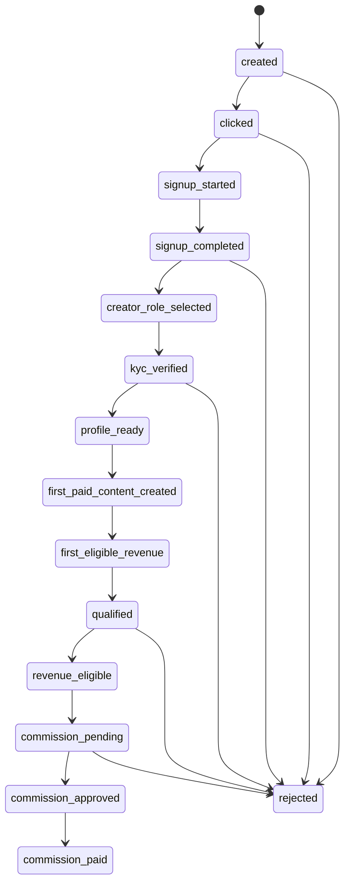
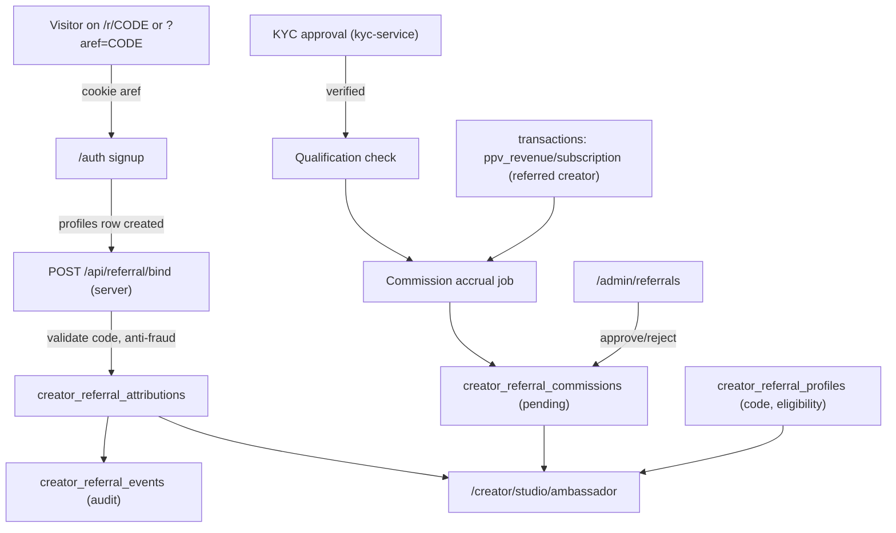
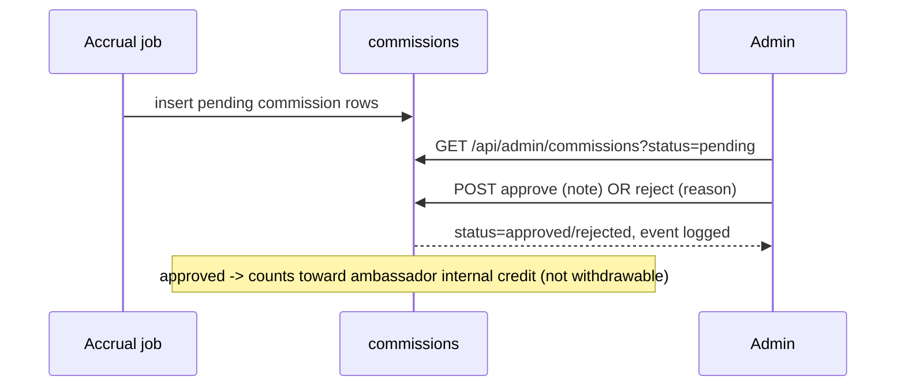

# Creator Ambassador Program — PRD + Technical Design + Implementation Plan

> Status: Planning (read-only design). No application code changed by this document.
> Owner: Growth / Platform. Target: GetFanSee (Next.js App Router + Supabase).
> Scope: MVP creator-to-creator referral ("Creator Ambassador Program").

This document is written so another agent can implement the feature safely in phases.
It is grounded in the **actual** code and schema found in this repository (see "Existing project
assumptions"). Where the codebase lacks a capability (e.g. no platform-fee logic, no payout RPC),
this document chooses the safe path: **track commissions as internal pending records only, not
withdrawable in MVP**.

---

## Part 0 — Existing project assumptions (grounded in real files)

These assumptions come from inspecting the repo. Implementers must re-verify before coding.

### Stack

- **Framework**: Next.js App Router, RSC enabled. No `"use server"` server actions found; business
  logic lives in Route Handlers `app/api/**/route.ts` + client `fetch`.
- **Auth**: Supabase Auth via `@supabase/auth-helpers-nextjs`, cookie sessions (`sb-access-token` /
  `sb-refresh-token`, httpOnly), synced by `POST /api/auth/session`.
- **Styling**: Tailwind CSS v4 (`@theme inline`), shadcn/ui `new-york` style, Radix + CVA, Lucide
  icons, Sonner toasts. Dark-only OLED theme (`<html className="dark">`).
- **DB**: Supabase Postgres. Migrations are plain SQL in `migrations/NNN_*.sql`, numbered with a
  3-digit prefix; current max is `041_*`. **Next migration = `042_`.**

### Supabase client helpers (use these, do not invent new ones)

- Browser: `getSupabaseBrowserClient()` — `lib/supabase-browser.ts`
- Server (RSC): `createClient()` / `getSupabaseServerClient` — `lib/server/supabase-server.ts`
  (re-exported by `lib/supabase-server.ts`)
- Route handlers: `getSupabaseRouteHandlerClient()` — `lib/server/supabase-route.ts`
- Admin / service role (bypasses RLS): `getSupabaseAdminClient()` — `lib/server/supabase-admin.ts`
  (re-exported by `lib/supabase-admin.ts`). **Never import into client bundles.**

### Auth/authz primitives (reuse, do not re-implement)

- `getCurrentUser()` — `lib/server/auth-server.ts` (returns `{ id, email }` or null; fail-closed on ban).
- `ensureProfile()` — creates a default `profiles` row (`role: 'fan'`, `age_verified: false`).
- `lib/authz.ts`: `requireUser()`, `requireAdmin()`, `requireCreator()`, `requireVerifiedCreator()`,
  `requireOwnerOrAdmin()`. All throw `HttpError` -> use `jsonError()`.
- `withAuth(handler)` — `lib/server/route-handler.ts`, injects `{ user }`, 401 if not logged in.
- Client bootstrap: `getAuthBootstrap()` / `invalidateAuthBootstrap()` (`lib/auth-bootstrap-client.ts`).

### Roles

- Stored in `profiles.role`: `'fan' | 'creator' | 'admin'` (CHECK constraint historically only allows
  `fan`/`creator`; `admin` is a convention value set manually). No `admins` table, no `is_admin` flag.
- Admin gating: middleware checks `app_metadata.role` then `profiles.role`; `requireAdmin()` checks
  `profile.role === 'admin'`; RLS uses `EXISTS (SELECT 1 FROM profiles WHERE id = auth.uid() AND role = 'admin')`.

### Creator onboarding / KYC (the qualification backbone)

- `profiles.role` flips to `'creator'` and `age_verified = true` at the **Didit KYC approval** point in
  `lib/kyc/kyc-service.ts` (also upserts a `creators` row). This is the authoritative
  fan -> creator transition.
- KYC tables: `creator_verifications` (status state machine incl. `approved`), `kyc_events`,
  `kyc_sessions`. Creator applications: `creator_applications` (may not exist as a migration; app falls
  back to `profiles.creator_application` JSONB).
- Upgrade routes: `/creator/upgrade`, `/creator/upgrade/apply` (`POST /api/creator/apply`),
  `/creator/upgrade/kyc`; legacy `/creator/onboarding`.

### Money / ledger (CRITICAL constraints)

- **Canonical wallet**: `wallet_accounts(user_id, available_balance_cents bigint, pending_balance_cents bigint)`.
- **Canonical ledger**: `transactions(user_id, type, amount_cents bigint, status, available_on, metadata jsonb)`.
  - `type IN ('deposit','withdrawal','subscription','ppv_purchase','ppv_unlock','ppv_revenue','commission','payout')`
    — **`'commission'` and `'payout'` are already reserved but have no write path yet.**
  - `status IN ('pending','completed','failed','refunded')`. Money unit is **cents** everywhere.
- **No platform fee**: PPV/subscription revenue currently goes 100% to the creator's
  `pending_balance_cents` (`unlock_ppv` RPC = `migrations/036_*`; subscribe = `app/api/subscribe/route.ts`).
- **No settlement job**: there is an index `idx_transactions_settlement` (`migrations/034_*`) but **no
  cron/RPC** moves `pending` -> `available`.
- **No payout/withdrawal RPC** exists. `available_on` defaults to "+7 days" on creator revenue rows.
- Atomic money ops use `SECURITY DEFINER` plpgsql RPCs that validate `auth.uid() IS DISTINCT FROM p_user_id`
  and use `pg_advisory_xact_lock`. Idempotency via `metadata->>'idempotency_key'` unique indexes.

### Existing referral primitive (will be superseded, not deleted)

- `profiles.referrer_id uuid` (`migrations/017_*`) + `lib/referral.ts` capture a **user-level** referral
  using `?ref=<userId>` -> cookie `referral_code` (30 days) -> `bindReferralOnSignup`. **`ref` is a raw
  user_id (PII-ish, enumerable) and there is no commission logic.** The Ambassador Program introduces an
  opaque code and a dedicated schema; it MAY reuse `referrer_id` as a denormalized pointer but MUST NOT
  rely on the legacy `?ref=userId` semantics for commissions.

> **CRITICAL migration principle — single source of truth (avoid dual attribution):**
> Once the new system ships, `profiles.referrer_id` MUST NOT be used as a basis for commission calculation.
> Otherwise two attribution sources coexist (`profiles.referrer_id` vs `creator_referral_attributions`),
> which will cause duplicate referrals, duplicate commissions, and attribution conflicts.
>
> Rules:
>
> - `creator_referral_attributions` **is the new source of truth** for attribution and commissions.
> - `profiles.referrer_id` is **legacy, read-only compatibility data**. Do not read it during new commission
>   accrual or qualification.
> - If legacy data must be migrated, it is a **one-time migration only**, and each migrated attribution row
>   MUST be tagged `source = 'legacy_profiles_referrer_id'` (e.g. in `metadata` / a `source` column) so it is
>   auditable and distinguishable from organic Ambassador-Program attributions. (Backfill remains out of
>   scope for MVP — see 2.13.)

### UI building blocks (reuse, do not invent a new visual style)

- Layout: `PageShell` (consumer pages, with `NavHeader` + mobile `BottomNavigation`); admin uses
  `app/admin/layout.tsx` + `components/admin/admin-sidebar.tsx` (no `PageShell`).
- Cards/stats: `card-block`, `bento-grid`, `glass-card`, `components/stat-card.tsx` (`StatCard`),
  `useCountUp`.
- States: `EmptyState`, `ErrorState`, `LoadingState`, `animate-pulse` skeletons.
- Lists: card rows + `divide-y` (the repo does NOT use shadcn `Table` for dashboards/admin).
- Copy-to-clipboard pattern: readonly `<input>` + Copy `Button` + Sonner `toast.success`
  (see `app/creator/studio/post/success/PublishSuccessPageClient.tsx`, `components/share-modal.tsx`).
- Badges: shadcn `Badge` with semantic classes (`bg-success/10 text-success`, etc.).
- Data fetching for dashboards: `"use client"` page + `getAuthBootstrap()` + `fetch('/api/...')`.

---

# Part 1 — Product Requirements (PRD)

## 1. Problem statement

GetFanSee's growth depends on acquiring **verified creators** who produce paid content. Paid acquisition
of adult creators is expensive and channel-restricted. The most credible acquisition channel is
**existing verified creators referring other creators**. Today the platform has a latent, user-level
`referrer_id` field but no program: no creator-facing referral link, no commission, no attribution
guarantees, no anti-fraud, and no admin review. We need an MVP **Creator Ambassador Program** that lets
verified creators invite new creators, attributes each new creator to exactly one referrer, and rewards
the referrer only when the referred creator becomes genuinely valuable (verified + revenue-eligible),
with commissions tracked safely (pending -> approved) and **not** auto-paid in MVP.

## 2. Target users

- **Existing verified creators (Ambassadors)** — want a simple link, clear status, and trustworthy
  earnings without seeing private data of people they referred.
- **New creators (Referred)** — sign up via a link, onboard, get verified, publish/earn. Their privacy
  and finances must be protected from the referrer.
- **Admin / Ops** — need to review qualifications, approve/reject commissions, flag fraud, override
  attribution, and report on program performance.

## 3. User stories

Ambassador:

- As a verified creator, I can find a "Become an Ambassador / Invite Creators" entry in my studio.
- As an ambassador, I get one unique referral code + shareable link, with a one-click copy.
- As an ambassador, I can see aggregate stats: clicks, signups, qualified creators, pending/approved commission.
- As an ambassador, I can see a list of my invited creators with **status only** (not their earnings,
  buyers, or identity beyond a safe display name/handle).
- As an ambassador, I can read the rules/FAQ (commission %, duration, when commission becomes available).

Referred creator:

- As a new user arriving via a referral link, my referral is captured automatically and bound to my
  account at signup, attributed to exactly one referrer.
- As a referred creator, my private earnings, buyers, and KYC details are never exposed to my referrer.

Admin:

- As an admin, I can search/filter referrals and commissions by status, ambassador, date, risk flag.
- As an admin, I can approve or reject pending commissions and add notes.
- As an admin, I can mark a referral as fraudulent/rejected and (rarely) manually set/override attribution.
- As an admin, I can see program KPIs.

## 4. MVP scope

- Ambassador eligibility gate: only verified creators.
- One referral code + link per ambassador (opaque, non-enumerable).
- Attribution capture (cookie) + binding at signup/onboarding, one referrer per referred creator, immutable
  after first bind (admin override only).
- Referral lifecycle tracking through `qualified` and `revenue_eligible`.
- Commission accrual as **internal pending records** (configurable %, default 5%, 12-month window,
  optional cap disabled by default).
- Admin review (approve/reject/fraud, notes) for commissions and referrals.
- Ambassador dashboard with privacy-safe aggregates + invited-creators status list + rules/FAQ.
- Admin management page.
- Settings table for configurable rules.

## 5. Out of scope for MVP

- Actual payout / withdrawal of commission (no money leaves the platform; not withdrawable).
- Multi-tier / multi-level referral (referrer of a referrer).
- Fan referrals or fan-side rewards (separate from this program).
- Automated fraud ML; only deterministic rule-based risk flags using existing data.
- Real-time settlement cron (commission availability is admin-approval-driven in MVP).
- Changing existing PPV/subscription money flow or introducing a platform fee.
- Public leaderboards, referral contests, custom landing pages per ambassador.

## 6. Referral lifecycle (state machine)

States stored on the attribution + event log:



> **IMPORTANT (qualification policy — strengthened):** KYC approval alone does **NOT** make a referral
> "successful". A user can sign up, pass KYC, then never publish or earn — counting that as a qualified
> referral would inflate the ambassador dashboard with **commercially worthless** referrals. Therefore the
> lifecycle is split into explicit sub-states, and the **MVP `qualified` bar requires real economic value**:
>
> **`qualified` = `kyc_verified` AND creator role active AND `first_eligible_revenue` completed.**
>
> (i.e. do not mark `qualified` merely on KYC pass; wait until the referred creator has produced at least
> one eligible, non-refunded, non-fraud revenue event — see section 8 eligibility rules.)

State definitions:

- `created` — code exists / link generated (ambassador profile state, not per-referral).
- `clicked` — referral link visited; cookie set (anonymous, pre-account).
- `signup_started` — visitor began signup with a referral cookie present.
- `signup_completed` — `profiles` row created and attribution bound to a referrer.
- `creator_role_selected` — referred user chose to become a creator / started creator onboarding.
- `kyc_verified` — referred user passed KYC (`creator_verifications.status = 'approved'`, `role = 'creator'`).
- `profile_ready` — referred creator completed basic profile setup (display name/avatar/etc.). Tracked for
  funnel analytics; **not** a gate for `qualified` in MVP.
- `first_paid_content_created` — referred creator created their first paid product (PPV `posts` with
  `price_cents > 0` and `review_status='approved'`, OR a subscription price set). Funnel signal.
- `first_eligible_revenue` — referred creator received their first **eligible** revenue event (see section 8
  eligibility rules). This is the economic-value gate.
- `qualified` — `kyc_verified` AND creator role active AND `first_eligible_revenue` completed. Only now does
  the referral count as a successful referral and the 12-month commission window anchor (`qualified_at`).
- `revenue_eligible` — referred creator continues generating eligible revenue inside the window; basis for
  ongoing commission accrual.
- `commission_pending` — commission accrued (estimated), awaiting settlement delay/admin review.
- `commission_approved` — admin approved; commission is an **internal credit** (not withdrawable in MVP).
- `commission_paid` — reserved for the future when payout exists. In MVP this state is **not reachable**
  via automation; only an admin may set it manually if/when off-platform payment occurs.
- `rejected` / `fraud` — terminal; no commission accrues; existing pending commissions voided.

> Note: `commission_*` are **commission-record** states; `created..revenue_eligible` are **referral/attribution**
> states. The schema separates these (attribution status vs commission status) but the UI presents one
> combined progress view. `creator_role_selected`, `profile_ready`, `first_paid_content_created`,
> `first_eligible_revenue` are funnel sub-states tracked via the events log; the attribution `status` column
> stores the coarse state (`signup_completed` -> `verified`/`kyc_verified` -> `qualified` -> `revenue_eligible`).

## 7. Business rules

1. Only **verified creators** (`role = 'creator'` AND KYC `approved`) can become ambassadors.
2. Exactly **one referral code** + link per ambassador (opaque slug; regeneration not in MVP).
3. A referred creator has **exactly one** referrer. First valid bind wins; immutable thereafter except by
   admin override.
4. **Attribution at signup/onboarding only.** A cookie captured on click is bound when the `profiles`
   row is first created. No post-hoc self-service attribution.
5. A referral becomes **qualified** only after ALL of (strengthened — economic value required):
   - referred user signed up (`signup_completed`), and
   - chose creator role / completed creator onboarding (`creator_role_selected`), and
   - completed KYC verification (`creator_verifications.status = 'approved'`, role active = `kyc_verified`), and
   - produced **first eligible revenue** (`first_eligible_revenue`): at least one **eligible** revenue event
     per section 8 (successful, not refunded/charged-back/voided, not test/internal, not self-purchase, not
     tied to a rejected/fraud attribution).
   - **MVP rule (do not relax):** `qualified = kyc_verified + creator role active + first_eligible_revenue`.
     Publishing a paid product alone (`first_paid_content_created`) is a funnel signal **but does NOT
     qualify** — we wait for real revenue so the platform never counts commercially worthless referrals as
     successes.
6. Commission is **never auto-paid**. It accrues as `pending`, then becomes `approved` (available, internal)
   after admin review OR a configured settlement delay (`approval_delay_days`), whichever the settings select.
   MVP default: **admin review required** (manual approve), `approval_delay_days` available as config.
7. Commission rule (MVP) — **estimated reward, not a payable balance**:
   - Configurable `commission_percent` (default **5%**, numeric stored as percent).
   - **Commission basis — must be defined explicitly.** Three possible interpretations of "5%":
     - 5% of **gross creator revenue** — NOT recommended (cost too high).
     - 5% of **platform fee** — most appropriate, BUT the platform has **no platform-fee logic today**.
     - 5% of **eligible net revenue** — acceptable, but requires a defined "net revenue" first.
   - **MVP decision (chosen):** because there is no platform fee and no settlement system, the commission is
     an **internal estimated reward** computed from the referred creator's **eligible transaction amount**
     using `commission_percent`. It is **NOT payable or withdrawable** until platform fee, settlement,
     chargeback, refund, and payout rules are implemented. Verbatim policy statement to use in code/UI/docs:
     > MVP commission is calculated as an internal estimated reward based on eligible transaction amount,
     > using the configured commission rate. It is not payable or withdrawable until platform fee,
     > settlement, chargeback, refund, and payout rules are implemented.
   - **Field separation (commission record):** distinguish three amounts —
     - `estimated_commission_amount` — accrued estimate (MVP uses this).
     - `approved_commission_amount` — admin-approved internal credit (MVP uses this).
     - `payable_commission_amount` — legally payable / withdrawable amount (**reserved, NOT used in MVP**;
       wired only when the future payout/platform-fee system exists).
   - The estimate does **not** deduct from the referred creator's earnings (informational only).
   - **Duration**: first **12 months** after the referred creator's `qualified_at`.
   - Optional **cap** (`commission_cap_cents`) supported by config; **disabled by default** (NULL).
8. Anti-fraud (see section 9).
9. Adult-platform privacy (see section 13): referrer never sees the referred creator's earnings amounts,
   buyer/fan identities, KYC/legal data, or exact transaction values.

## 8. Commission rules (detailed)

- **Eligible revenue definition (authoritative):**
  > Eligible revenue = a successful paid transaction that is **not** refunded, **not** charged back, **not**
  > voided/reversed, **not** test/internal, **not** an admin comp/internal credit, **not** a creator
  > self-purchase, **not** flagged by risk control, **not** in a payout dispute, and **not** linked to a
  > rejected/fraudulent referral attribution.
- The accrual job reads `transactions`, but reading `transactions` alone is **insufficient** — it MUST apply
  the exclusions above. Excluded categories:
  - `refunded` transactions, chargebacks, `failed` payments, `voided`/`reversed` transactions
  - test payments, admin comps, internal credits
  - creator self-purchase (referred creator buying their own content)
  - revenue flagged by risk control / under payout dispute
  - any revenue tied to an attribution where `is_fraud = true` or `status IN ('rejected','fraud')`
- **Known schema limitation (MVP, do NOT fake completeness):** the current `transactions` table has
  `type IN (...)` and `status IN ('pending','completed','failed','refunded')` but does **not** natively
  model chargeback, void/reversal, test/internal, self-purchase, or risk-flag states. For MVP we can only
  enforce the exclusions that map to existing data (`status='refunded'`/`'failed'` exclusion, fraud/rejected
  attribution exclusion, and self-purchase if derivable from buyer == creator). The remaining exclusions
  (chargeback, void, test/internal, risk-flag, payout dispute) are documented as a **limitation** to be
  enforced once those fields/states exist — they must NOT be silently assumed present.
- **Eligible revenue events (current data implementation)**: `transactions` rows credited to the referred
  creator with `type IN ('ppv_revenue','subscription')` (positive `amount_cents`), `status='completed'`
  (exclude `pending`/`failed`/`refunded`), not a self-purchase, and the attribution is not fraud/rejected,
  created within `[qualified_at, qualified_at + 12 months]`.
- **Accrual model**: For each eligible revenue event, accrue
  `commission_amount_cents = floor(amount_cents * commission_percent / 100)`.
  Implementation choice (MVP): **periodic batch accrual** (admin-triggered or cron-ready job) that sums
  eligible revenue per referred creator since the last accrual watermark and creates ONE
  `creator_referral_commissions` row per (attribution, period). This avoids hooking into the hot
  `unlock_ppv` path and avoids changing existing money flow.
- **Cap**: if `commission_cap_cents` is set, total approved+pending commission per attribution cannot exceed it.
- **Status flow on a commission row**: `pending -> approved -> (paid, future)` or `pending -> rejected/void`.
- **Availability**: `approved` commissions sum into an ambassador-visible "available commission (internal)"
  figure. **Not withdrawable in MVP** — clearly labeled as internal/credit, pending future payout feature.
- **No connection to `wallet_accounts` balances in MVP.** Optionally, an `approved` commission MAY write a
  mirror `transactions` row with `type='commission'`, `status='pending'`, `amount_cents = commission`,
  `available_on = NULL`, and `metadata.kind='ambassador_commission'` for ledger auditability — **without**
  touching `available_balance_cents`/`pending_balance_cents`. (Recommended for auditability; gate behind a
  settings flag `mirror_to_ledger` defaulting to false to keep Phase 5 minimal.)

## 9. Anti-fraud rules

- **No self-referral**: reject if `referrer_id == referred_user_id`, or same `auth.users.email`
  (case-insensitive), enforced server-side at bind time.
- **No multiple accounts from the same user**: deterministic duplicate risk flags using available data:
  - duplicate normalized email / email alias (e.g. `+` tags) -> `risk_flags += 'email_duplicate'`
  - duplicate signup IP within a short window (if IP is captured; `age_verifications.ip_address` exists,
    and we can capture IP at signup bind via request headers) -> `'ip_duplicate'`
  - shared device fingerprint hash (only if/where already collected; otherwise skip — do NOT add new
    invasive tracking for MVP) -> `'device_duplicate'`
  - KYC duplicate (same verified identity referred more than once, if `creator_verifications` exposes a
    stable hash) -> `'kyc_duplicate'`
- **No post-signup attribution** except explicit admin override (logged as an event with admin id).
- **Admin can mark a referral/commission as rejected/fraudulent**; this voids pending commissions and
  blocks future accrual for that attribution.
- All risk flags are **advisory** (do not auto-block payment beyond pending); they surface in admin UI.
- Server-side only: never trust client-provided referrer ids, commission amounts, or status.

## 10. Data tracking & analytics

Tracked per attribution + event log:

- Funnel counts per ambassador: clicks, signups, onboarding starts, verified, qualified, revenue-eligible.
- Conversion rates: click->signup, signup->verified, verified->qualified, qualified->revenue.
- Commission: total pending, total approved, total (future) paid, per ambassador and program-wide.
- Cohorts: referred creators by `qualified_at` month; revenue contribution (aggregate, admin-only).
- Risk: count of flagged/rejected referrals.
- Events table (`creator_referral_events`) is the immutable audit trail powering analytics + debugging.

## 11. Admin operation needs

- List/search/filter referrals and commissions by: ambassador, referred creator, status, date range, risk flag.
- View a referral's full timeline (events).
- Approve / reject commissions (single + note); reject reasons recorded.
- Mark referral fraudulent / rejected (voids pending commissions).
- Manual attribution override (set/clear referrer for a referred creator) — logged with admin id + reason.
- Edit program settings (`commission_percent`, `duration_months`, `commission_cap_cents`,
  `approval_delay_days`, `mirror_to_ledger`, `program_enabled`).
- Export (CSV) of commissions for off-platform payout (future).

### Audit trail (required)

Every admin decision must be explainable later (e.g. an ambassador asks "why was my commission rejected?").
Each reviewable record (`creator_referral_commissions`, and override/fraud actions on
`creator_referral_attributions`) MUST carry / emit:

- `reviewed_by` — admin user id.
- `reviewed_at` — timestamp.
- `review_note` — free-text admin note.
- `status_reason` — structured reason code (e.g. `refund`, `chargeback`, `duplicate_account`,
  `policy_violation`, `account_suspended`, `dmca`, `payout_disputed`, `risk_flag`, `other`).
- `admin_action_source` — where the action came from (`admin_ui`, `cron_recompute`, `script`, etc.).
- Plus an immutable `creator_referral_events` row for the action (actor id, reason, before/after).

Adult-platform situations that commonly trigger admin review / reversal (must be recordable):

- referred creator later **banned/suspended**;
- after KYC pass, a **duplicate account** is discovered;
- transaction revenue **charged back**;
- **content/policy violation**;
- creator hit with a **DMCA** complaint;
- **payout suspended / disputed**.

## 12. Edge cases

- Referred user signs up but never becomes a creator -> stays `signup_completed`, no commission.
- Referred creator gets verified then banned/refunded -> revenue events with negative/refunded status are
  excluded; existing accrued commission for refunded revenue is reversed/voided by admin or by accrual
  recompute.
- Self-referral via second email -> caught by email/IP/KYC duplicate flags; admin rejects.
- Multiple referral cookies (user clicks several links) -> **first-touch wins** at bind time (store first
  captured code; ignore later). Document explicitly.
- Cookie cleared before signup -> no attribution (acceptable; no recovery without admin override).
- Ambassador loses verified status (KYC revoked/banned) -> stops accruing new commission; existing pending
  commissions held for admin review.
- Referred creator passes 12-month window -> revenue after window is ineligible.
- Code collision -> generation retries until unique (unique constraint).
- Referrer == referred but different casing/whitespace in email -> normalize before compare.
- Duplicate accrual / double counting -> guarded by accrual watermark + unique key per (attribution, period).
- Program disabled mid-flight -> no new accrual; existing pending records remain for admin decision.

## 13. Compliance & privacy considerations (adult platform)

- **Referrer must NOT see**: referred creator's earnings amounts, buyer/fan identities, transaction details,
  KYC/legal name, email, or contact info. Only: a safe display name/handle + avatar (already public via
  `public_creator_profiles`) + lifecycle status + whether they are "active/qualified".
- Ambassador commission figures are **the ambassador's own** aggregate numbers, not the referred creator's
  revenue. Never expose the basis revenue to the referrer (even rounded). Show only the ambassador's earned
  commission totals.
- Referral codes are **opaque** (random slug), not user ids, to avoid enumerating accounts.
- All admin financial/identity views require `requireAdmin()` and run server-side via service role with
  explicit field selection (never `select('*')` into a referrer-facing surface).
- Respect existing geo-block / age-gate; referral links land on public/auth pages that already enforce these.
- Log admin overrides for auditability (who/when/why).
- GDPR/CCPA: attribution + events keyed by user id; deletion of a user cascades (`ON DELETE CASCADE`) and
  voids related commissions.

## 14. Success metrics

- # of active ambassadors (creators who shared a link and got >=1 click).
- # of referred signups; click->signup conversion.
- # of **qualified** referred creators (north-star quality metric).
- Qualified-creator conversion rate vs non-referred baseline.
- Total/avg commission accrued per qualified creator.
- Fraud rate (% referrals flagged/rejected).
- Time-to-qualify (signup -> qualified median).

---

# Part 2 — Technical design

## 2.1 High-level architecture



Key principles:

- **No changes to the hot money path** (`unlock_ppv`, subscribe). Commission is computed by a separate
  batch accrual reading `transactions`, keeping risk low.
- **Server-authoritative** everything: codes resolved server-side, attribution bound server-side, amounts
  computed server-side, status changes admin-only.
- New schema, additive migrations only; reuse `profiles.referrer_id` as a denormalized convenience pointer.

## 2.2 Proposed database tables (migration `042_creator_ambassador_program.sql`)

Adapt names/types to current conventions: `*_cents bigint`, `timestamptz`, `gen_random_uuid()`,
`auth.users(id)` FKs, `set_updated_at()` trigger, idempotent `IF NOT EXISTS`.

### `creator_referral_settings` (singleton config)

| column                      | type                                   | notes                              |
| --------------------------- | -------------------------------------- | ---------------------------------- |
| `id`                        | `int` PK CHECK (`id = 1`)              | enforce single row                 |
| `program_enabled`           | `boolean` NOT NULL DEFAULT `true`      | global kill switch                 |
| `commission_percent`        | `numeric(5,2)` NOT NULL DEFAULT `5.00` | default 5%                         |
| `duration_months`           | `int` NOT NULL DEFAULT `12`            | accrual window                     |
| `commission_cap_cents`      | `bigint` NULL                          | NULL = disabled                    |
| `approval_delay_days`       | `int` NOT NULL DEFAULT `0`             | 0 = manual admin approval required |
| `require_admin_approval`    | `boolean` NOT NULL DEFAULT `true`      | MVP true                           |
| `mirror_to_ledger`          | `boolean` NOT NULL DEFAULT `false`     | optional `transactions` mirror     |
| `created_at` / `updated_at` | `timestamptz`                          |                                    |

Seed one row with defaults.

### `creator_referral_profiles` (one per ambassador)

| column                      | type                                                               | notes                   |
| --------------------------- | ------------------------------------------------------------------ | ----------------------- |
| `id`                        | `uuid` PK DEFAULT `gen_random_uuid()`                              |                         |
| `user_id`                   | `uuid` NOT NULL UNIQUE FK -> `auth.users(id)` ON DELETE CASCADE    | the ambassador          |
| `referral_code`             | `text` NOT NULL UNIQUE                                             | opaque slug (see 2.5)   |
| `status`                    | `text` NOT NULL DEFAULT `'active'` CHECK in (`active`,`suspended`) | suspend on ban/KYC loss |
| `created_at` / `updated_at` | `timestamptz`                                                      |                         |

### `creator_referral_attributions` (one per referred user)

| column                      | type                                                                                                                          | notes                                       |
| --------------------------- | ----------------------------------------------------------------------------------------------------------------------------- | ------------------------------------------- |
| `id`                        | `uuid` PK                                                                                                                     |                                             |
| `referrer_user_id`          | `uuid` NOT NULL FK -> `auth.users(id)` ON DELETE CASCADE                                                                      | ambassador                                  |
| `referred_user_id`          | `uuid` NOT NULL UNIQUE FK -> `auth.users(id)` ON DELETE CASCADE                                                               | one referrer per referred                   |
| `referral_code`             | `text` NOT NULL                                                                                                               | snapshot of code used                       |
| `status`                    | `text` NOT NULL DEFAULT `'signup_completed'`                                                                                  | lifecycle (see CHECK below)                 |
| `qualified_at`              | `timestamptz` NULL                                                                                                            | set when `qualified` reached; window anchor |
| `window_ends_at`            | `timestamptz` NULL                                                                                                            | `qualified_at + duration_months`            |
| `risk_flags`                | `text[]` NOT NULL DEFAULT `'{}'`                                                                                              | anti-fraud advisory flags                   |
| `is_fraud`                  | `boolean` NOT NULL DEFAULT `false`                                                                                            | admin-set                                   |
| `signup_ip`                 | `inet` NULL                                                                                                                   | captured at bind (for duplicate detection)  |
| `source`                    | `text` NOT NULL DEFAULT `'ambassador_program'` CHECK in (`ambassador_program`,`legacy_profiles_referrer_id`,`admin_override`) | attribution origin (single source of truth) |
| `bound_by_admin`            | `uuid` NULL FK -> `auth.users(id)`                                                                                            | set only on manual override                 |
| `created_at` / `updated_at` | `timestamptz`                                                                                                                 |                                             |

`status` CHECK in: `signup_completed`, `creator_onboarding_started`, `verified`, `qualified`,
`revenue_eligible`, `rejected`, `fraud`. (`created/clicked/signup_started` are pre-account and live only as
events; the attribution row is created at first bind = `signup_completed`.)

### `creator_referral_events` (immutable audit log)

| column           | type                                                                    | notes                                                                                                                                                                                                       |
| ---------------- | ----------------------------------------------------------------------- | ----------------------------------------------------------------------------------------------------------------------------------------------------------------------------------------------------------- |
| `id`             | `uuid` PK                                                               |                                                                                                                                                                                                             |
| `attribution_id` | `uuid` NULL FK -> `creator_referral_attributions(id)` ON DELETE CASCADE | null for pre-account click events                                                                                                                                                                           |
| `referral_code`  | `text` NULL                                                             | for click events before attribution exists                                                                                                                                                                  |
| `event_type`     | `text` NOT NULL                                                         | `clicked`,`signup_started`,`signup_completed`,`onboarding_started`,`verified`,`qualified`,`revenue_eligible`,`commission_accrued`,`commission_approved`,`commission_rejected`,`fraud_flag`,`admin_override` |
| `actor_user_id`  | `uuid` NULL                                                             | admin or system                                                                                                                                                                                             |
| `metadata`       | `jsonb` NOT NULL DEFAULT `'{}'`                                         | ip hash, amounts (admin-only context), reason                                                                                                                                                               |
| `created_at`     | `timestamptz` NOT NULL DEFAULT now()                                    |                                                                                                                                                                                                             |

### `creator_referral_commissions`

| column                              | type                                                                                  | notes                                                                                                                                |
| ----------------------------------- | ------------------------------------------------------------------------------------- | ------------------------------------------------------------------------------------------------------------------------------------ |
| `id`                                | `uuid` PK                                                                             |                                                                                                                                      |
| `attribution_id`                    | `uuid` NOT NULL FK -> `creator_referral_attributions(id)` ON DELETE CASCADE           |                                                                                                                                      |
| `referrer_user_id`                  | `uuid` NOT NULL FK -> `auth.users(id)`                                                | denormalized for fast ambassador queries                                                                                             |
| `referred_user_id`                  | `uuid` NOT NULL FK -> `auth.users(id)`                                                |                                                                                                                                      |
| `period_start` / `period_end`       | `timestamptz` NOT NULL                                                                | accrual window slice                                                                                                                 |
| `basis_revenue_cents`               | `bigint` NOT NULL                                                                     | sum of eligible revenue in period (admin-only field)                                                                                 |
| `commission_percent`                | `numeric(5,2)` NOT NULL                                                               | snapshot at accrual                                                                                                                  |
| `estimated_commission_amount_cents` | `bigint` NOT NULL CHECK (>= 0)                                                        | accrued estimate (MVP uses this)                                                                                                     |
| `approved_commission_amount_cents`  | `bigint` NULL CHECK (>= 0)                                                            | admin-approved internal credit (MVP uses this)                                                                                       |
| `payable_commission_amount_cents`   | `bigint` NULL CHECK (>= 0)                                                            | **reserved, NOT used in MVP**; legally payable/withdrawable amount (future payout system)                                            |
| `status`                            | `text` NOT NULL DEFAULT `'pending'` CHECK in (`pending`,`approved`,`rejected`,`paid`) |                                                                                                                                      |
| `reviewed_by`                       | `uuid` NULL FK -> `auth.users(id)`                                                    | admin                                                                                                                                |
| `reviewed_at`                       | `timestamptz` NULL                                                                    |                                                                                                                                      |
| `review_note`                       | `text` NULL                                                                           | free-text admin note                                                                                                                 |
| `status_reason`                     | `text` NULL                                                                           | structured reason code (refund/chargeback/duplicate_account/policy_violation/account_suspended/dmca/payout_disputed/risk_flag/other) |
| `admin_action_source`               | `text` NULL                                                                           | `admin_ui` / `cron_recompute` / `script`                                                                                             |
| `ledger_transaction_id`             | `uuid` NULL FK -> `transactions(id)`                                                  | set only if `mirror_to_ledger`                                                                                                       |
| `created_at` / `updated_at`         | `timestamptz`                                                                         |                                                                                                                                      |
| UNIQUE                              | (`attribution_id`, `period_start`, `period_end`)                                      | prevent double accrual                                                                                                               |

> Naming note: `amount_cents` referenced elsewhere in this doc maps to `estimated_commission_amount_cents`
> in MVP. `payable_commission_amount_cents` stays NULL/unused until the future payout system is built.

Indexes: `referrer_user_id` (all tables that have it), `referred_user_id`, `status`,
`attributions(referral_code)`, `attributions(status)`, `events(attribution_id, created_at)`,
`commissions(status, created_at)`.

> `basis_revenue_cents` is **admin-only** and must never be selected into a referrer-facing API/view.

## 2.3 RLS policies (Supabase) — follow existing conventions

Enable RLS on all five tables. Conventions: name policies `{table}_{action}_{scope}`; use `auth.uid()`;
admin via `EXISTS (SELECT 1 FROM profiles WHERE id = auth.uid() AND role = 'admin')`.

- `creator_referral_settings`
  - SELECT: admin only (`..._select_admin`). (App reads settings via service role in accrual job; admin UI reads via admin policy.)
  - INSERT/UPDATE: admin only.
- `creator_referral_profiles`
  - `..._select_own`: `auth.uid() = user_id`.
  - `..._select_admin`: admin.
  - INSERT/UPDATE: **none for clients** — created/updated via service role in server route (after
    `requireVerifiedCreator()`), so no client write policy (deny by default). Admin policy optional.
- `creator_referral_attributions`
  - `..._select_referrer`: `auth.uid() = referrer_user_id` **BUT** only exposes safe columns via a
    dedicated view (see below) — the base table is NOT directly readable by referrer to avoid leaking
    `signup_ip`, `risk_flags`, etc. Recommended: **deny direct client SELECT on base table**; expose a
    `security_barrier` view `ambassador_referrals_safe` with whitelisted columns.
  - `..._select_admin`: admin (full).
  - INSERT/UPDATE: service role only (deny client writes).
- `creator_referral_events`
  - SELECT: admin only. (Referrer-facing timeline, if any, comes from the safe view, not raw events.)
  - INSERT: service role only.
- `creator_referral_commissions`
  - `..._select_referrer`: `auth.uid() = referrer_user_id` — but again expose via safe view that **omits
    `basis_revenue_cents`** and `referred_user_id` (replace with safe handle). Prefer: deny base SELECT to
    clients; serve ambassador data through API using service role with explicit field projection.
  - `..._select_admin`: admin (full).
  - INSERT/UPDATE: service role / admin only.

Recommended safe view (security barrier), referrer-facing:

```sql
CREATE VIEW public.ambassador_referrals_safe WITH (security_barrier = true) AS
SELECT a.id,
       a.referrer_user_id,
       a.status,
       a.qualified_at,
       a.created_at,
       p.display_name,   -- safe public handle
       p.avatar_url
FROM public.creator_referral_attributions a
JOIN public.public_creator_profiles p ON p.id = a.referred_user_id
WHERE a.is_fraud = false;
```

(Join `public_creator_profiles` so only public creator handles leak, never email/legal name. If a referred
user is not yet a public creator, expose only a generic masked label like "Pending creator" — implement by
LEFT JOIN + COALESCE to a masked placeholder, never email.)

> Because most writes use the service role and most reads of sensitive data happen in admin/server routes,
> the **defense-in-depth** stance is: deny-by-default client access on base tables, and serve ambassador
> reads through API routes with explicit projection. RLS policies are the backstop.

## 2.4 API routes / server actions

No server actions in the repo; use Route Handlers `app/api/...route.ts` (+ client `fetch`), matching
existing style.

Ambassador (creator) APIs:

- `POST /api/referral/enroll` — `requireVerifiedCreator()`; creates/returns the caller's
  `creator_referral_profiles` row + code. Idempotent.
- `GET  /api/referral/me` — `requireVerifiedCreator()`; returns `{ code, link, stats, commissionSummary }`
  via service role with explicit projection (privacy-safe).
- `GET  /api/referral/me/referrals` — paginated invited-creators list from `ambassador_referrals_safe`.

Attribution APIs:

- `POST /api/referral/track` — public; records a `clicked` event (rate-limited). Optional (can rely on
  cookie only). If used, validate code exists; store hashed IP in metadata.
- `POST /api/referral/bind` — called server-side during signup/onboarding (NOT trusted from client). See 2.7.
  Validates code, anti-fraud, creates attribution. Internally invoked from `ensureProfile`/bootstrap, not a
  public mutation that accepts arbitrary `referred_user_id`.

Admin APIs (all `requireAdmin()`):

- `GET  /api/admin/referrals` — search/filter referrals (full fields).
- `GET  /api/admin/referrals/[id]` — detail + events timeline.
- `POST /api/admin/referrals/[id]/override` — manual attribution set/clear (logged).
- `POST /api/admin/referrals/[id]/fraud` — mark fraud/reject (voids pending commissions).
- `GET  /api/admin/commissions` — list/filter commissions.
- `POST /api/admin/commissions/[id]/approve` — approve (+ optional ledger mirror).
- `POST /api/admin/commissions/[id]/reject` — reject (+ note).
- `GET/PUT /api/admin/referral-settings` — read/update settings.
- `POST /api/admin/commissions/accrue` — trigger accrual job (also runnable via `app/api/cron/...`).

Accrual job:

- Prefer `app/api/cron/referral-accrual/route.ts` (Vercel cron compatible; there is already
  `app/api/cron/financial-audit`). Auth via cron secret header, service role inside.

## 2.5 Referral code generation

- Generate an **opaque, URL-safe, non-enumerable** slug: 8–10 chars from a base32 alphabet excluding
  ambiguous chars (`0/O/1/I`). Example: `nanoid`-style or `crypto.randomBytes` -> base32.
- Generated **server-side** in `POST /api/referral/enroll`. Loop on unique-constraint violation (retry up
  to N times).
- Optionally derive a stable HMAC from `user_id + secret` truncated to slug length for determinism; but a
  random unique slug is simpler and avoids leaking derivation. **Recommend random + unique index.**
- Link format: `https://<host>/r/<code>` (clean) with `/r/[code]/route.ts` (or `page.tsx`) that sets the
  cookie then redirects to `/auth?mode=signup`. Also accept `?aref=<code>` on any page for flexibility.

## 2.6 Attribution capture (cookie / storage / session)

- New cookie name `aref` (do NOT overload legacy `referral_code`, which stores a user_id). Value = opaque
  code. `path=/; Max-Age=2592000 (30d); SameSite=Lax`. **Set the cookie server-side as `httpOnly`** from the
  `/r/[code]` route handler (the authoritative capture path). Because **the bind decision is server-side**
  and re-validates the code, a tampered cookie can only point to a valid code, never inject a user id or
  amount.
- **Server-side cookie is the source of truth for attribution.** `localStorage` MAY be used only as a
  display/analytics aid; it MUST NOT drive the actual bind. Real attribution = server-side `httpOnly`
  cookie + server-side attach at signup.
- Cookie/attribution flow:
  ```
  ?ref=CODE (or /r/CODE)
    -> validate active referral_code (server-side)
    -> set httpOnly referral cookie, 30 days (first-touch only; do not overwrite)
    -> on signup: server-side attach
    -> create creator_referral_attributions (source = 'ambassador_program')
  ```
- Capture points:
  - `/r/[code]` route handler: set `aref` cookie server-side (Set-Cookie, httpOnly), fire `clicked` event,
    redirect. **Primary, trusted capture.**
  - `captureAmbassadorRef()` client helper (new, in `lib/referral.ts` or `lib/ambassador.ts`): reads
    `?aref=`/`?ref=` on any page load for UX/banner display; may set a non-authoritative hint, but the bind
    still relies on the server-side cookie.

### Attribution rules (avoid attribution disputes)

Attribution disputes are one of the biggest referral risks. Explicit rules (MVP):

- First valid referral wins. Do not overwrite an existing attribution unless an admin manually overrides.

Scenarios:

- User clicks A's referral link first -> record **A**.
- User later clicks B's referral link -> **do NOT overwrite** (first-touch wins).
- An **already-registered** user clicks a referral link -> **no attribution** (attribution only at first
  profile creation).
- A creator clicks **their own** link -> **block** (self-referral, see section 9).
- Admin manually changes attribution -> allowed but **requires audit log** (`bound_by_admin`, reason event,
  `source='admin_override'`).

## 2.7 Attaching attribution during signup/onboarding

- Hook into the **authoritative profile-creation path** server-side. Two integration points:
  1. `ensureProfile()` server variant (`lib/server/auth-server.ts`) — after inserting a new `profiles`
     row, read the `aref` cookie (via `next/headers` cookies), resolve code -> referrer, run anti-fraud,
     and insert `creator_referral_attributions` (status `signup_completed`) + denormalize
     `profiles.referrer_id`. Do this in a dedicated `bindAmbassadorAttribution(userId, cookieCode, req)`
     in a new `lib/server/ambassador.ts`, called once on first profile creation.
  2. Creator onboarding start (`/api/creator/apply` or KYC session create) — transition existing
     attribution to `creator_onboarding_started`.
- The KYC approval path (`lib/kyc/kyc-service.ts`, where `role` flips to `creator`) transitions attribution
  to `verified` and then runs `evaluateQualification(referredUserId)`.
- **Never** accept `referred_user_id` from the client. The bound user is always the session user
  (`auth.uid()` / `getCurrentUser().id`).
- Qualification evaluation (`evaluateQualification`) — strengthened: requires `kyc_verified` AND creator
  role active AND **first eligible revenue completed** (`first_eligible_revenue`, per section 8 eligibility,
  excluding refunded/failed/self-purchase/fraud). Publishing a paid product is recorded as
  `first_paid_content_created` (funnel) but does NOT qualify on its own. On success set `status='qualified'`,
  `qualified_at=now()`, `window_ends_at=now()+duration_months`, emit `qualified` event.

## 2.8 Commission calculation

- Batch accrual (`POST /api/admin/commissions/accrue` and/or cron):
  1. Load settings (service role). If `program_enabled=false`, exit.
  2. For each `attribution` with `status IN ('qualified','revenue_eligible')`, `is_fraud=false`,
     `status NOT IN ('rejected','fraud')`, and `now() <= window_ends_at`: - Sum **eligible** `transactions` for `referred_user_id` (section 8 definition: `type IN
('ppv_revenue','subscription')`, positive amount, `status='completed'` (exclude
     `pending`/`failed`/`refunded`), not a self-purchase; documented limitations for chargeback/void/
     test/internal/risk-flag), `created_at` within `[max(qualified_at, last_accrual_watermark), now()]`. - `estimated = floor(sum * commission_percent / 100)`; apply cap if set. - If `estimated > 0`, upsert one `creator_referral_commissions` row for the period (unique key prevents
     dupes), status `pending`, writing `estimated_commission_amount_cents` (leave `approved_*`/`payable_*`
     NULL); set attribution `status='revenue_eligible'`; emit `commission_accrued`.
  3. Watermark stored on attribution or derived from latest commission `period_end`.
- **Refund handling**: exclude `status='refunded'` revenue; if a later recompute reduces basis, admin can
  reject/adjust affected pending commissions (MVP: manual). Document as known limitation.
- All math in integer cents, `floor` rounding, no floats for money.

## 2.9 Connection to wallet/ledger

- **MVP default: NOT connected.** Commissions live only in `creator_referral_commissions`; they do not
  change `wallet_accounts` balances and are **not withdrawable**.
- Ambassador "available commission" = SUM of `approved` commissions (internal credit, clearly labeled).
- **Optional ledger mirror** (`settings.mirror_to_ledger = true`): on approve, insert a `transactions` row
  `{ user_id: referrer, type:'commission', amount_cents, status:'pending', available_on: NULL,
metadata:{ kind:'ambassador_commission', commission_id } }` for audit only — **do not** increment
  `available_balance_cents`. Future payout feature would later move these to `available`/`payout`.
- Rationale: there is no platform-fee pool and no settled payout system; auto-crediting withdrawable
  balance would create real liability without a funding source or payout rails. Keep it internal.

## 2.10 Admin review flow



- Approve: set `status='approved'`, `reviewed_by`, `reviewed_at`; emit event; optional ledger mirror.
- Reject: set `status='rejected'`, note; emit event.
- Fraud on referral: set attribution `is_fraud=true`, `status='fraud'`; bulk-void its `pending` commissions.
- Override: set/clear `referrer_user_id` (+ `bound_by_admin`, reason event). Validate no self-referral.

## 2.11 Error handling

- API: reuse `HttpError`/`jsonError()` and the `requireX()` throw pattern; standard JSON `{ error }` shape.
- Bind: never hard-fail signup if attribution fails — log + continue (attribution is best-effort, money is
  not). Wrap `bindAmbassadorAttribution` in try/catch like existing `bindReferralOnSignup`.
- Accrual: idempotent via unique key; safe to re-run; per-attribution failures logged, job continues.
- Code generation: retry on unique violation; surface friendly error after N retries.
- Validation: zod (already in deps via `@hookform/resolvers`/`zod`) for request bodies; reject unknown fields.

## 2.12 Security constraints (hard requirements)

- Server-side validation only. Never trust client `userId`, `referralId`, `commissionId` ownership, or
  `amount`. Resolve ownership from session + DB.
- Do not expose `SUPABASE_SERVICE_ROLE_KEY` to client; service role usage stays in `lib/server/*` and
  route handlers. (Repo has CI checks `check:service-role`, `check:admin-client` — must keep passing.)
- Do not bypass RLS for client-reachable reads; serve sensitive data via admin-gated server routes.
- Never leak referred creator earnings/buyer/KYC/email to the referrer; enforce via safe view + explicit
  API projection.
- Rate-limit `/r/[code]` and `/api/referral/track` to mitigate click fraud / enumeration.
- Codes opaque (no user ids in URLs).
- Admin actions logged (events) with actor id.

## 2.13 Migration plan

- Single additive migration `migrations/042_creator_ambassador_program.sql`:
  - Create 5 tables + indexes + `set_updated_at` triggers (reuse existing function).
  - Create `ambassador_referrals_safe` view.
  - Enable RLS + policies per 2.3.
  - Seed `creator_referral_settings` (id=1, defaults).
  - Idempotent (`IF NOT EXISTS`, `DROP POLICY IF EXISTS ... CREATE POLICY`).
  - No changes to existing tables except an optional comment; reuse `profiles.referrer_id` (already exists).
  - Include a header comment + verification `DO $$ ... RAISE NOTICE` block (house style).
- Provide a companion rollback note (drop new objects only); follow the `024_rollback.sql` precedent if a
  rollback file is desired.
- No backfill required for MVP (program starts forward-looking). Optional: backfill attributions from
  existing `profiles.referrer_id` is **explicitly out of scope** (legacy semantics differ). If ever done, it
  MUST be a one-time migration that tags each row `source = 'legacy_profiles_referrer_id'` and MUST NOT feed
  commission accrual. `creator_referral_attributions` is the single source of truth; `profiles.referrer_id`
  stays legacy read-only and is never read by accrual/qualification (see Part 0 "Existing referral primitive").
- Add a `source` column (or `metadata.source`) to `creator_referral_attributions` to distinguish
  `'ambassador_program'` (default) from `'legacy_profiles_referrer_id'` and `'admin_override'`.

## 2.14 Testing plan

- **Unit (vitest)**: code generator (uniqueness/charset), commission math (percent, floor, cap, window
  boundaries), anti-fraud predicates (self-referral, email normalize, duplicate flags), qualification
  evaluator.
- **Integration (route handlers)**: enroll idempotency; bind happy path + self-referral rejection +
  post-signup rejection; admin approve/reject authorization (non-admin -> 403); settings update.
- **RLS tests**: referrer cannot read another ambassador's rows; referrer cannot read `basis_revenue_cents`
  or referred email; non-admin cannot read settings/events.
- **E2E (Playwright)**: link click -> cookie -> signup -> attribution row; ambassador dashboard shows
  privacy-safe data; admin page approve flow. Reuse `auth-mock` project patterns.
- **Privacy assertion test**: snapshot ambassador API/view response and assert it contains NO earnings
  amounts of the referred creator, no email, no buyer info (extend `tests/verify_privacy_logic.ts`).
- **Money-safety test**: assert accrual does not modify `wallet_accounts` balances; assert no withdrawable
  credit created (extend `tests/audit_billing.ts`).
- Keep `pnpm check-all` (type-check, lint, format, service-role/admin-client guards) green.

---

# Part 3 — UI / UX design (reuse existing design system)

> Do NOT invent a new visual style. Use `card-block` / `bento-grid` / `glass-card` / `StatCard` /
> `EmptyState` / `ErrorState` / Sonner toasts / shadcn `Badge` / `Button` variants, OLED violet/gold theme.

## 3.1 Creator dashboard entry point

- Add an "Ambassador" / "Invite Creators" nav item to the **Studio sidebar** (`/creator/studio` desktop
  `aside` + the mobile 2x2 quick-grid) pointing to `/creator/studio/ambassador`.
- Gate: visible only when `requireVerifiedCreator()` passes (client checks `getAuthBootstrap()` role +
  verification; mirror server gate in the page/API).
- Optional small promo `card-block` on the studio dashboard: "Earn 5% by inviting creators" -> CTA.

## 3.2 Creator Ambassador page (`/creator/studio/ambassador/page.tsx`, client component)

Layout via `PageShell maxWidth="6xl" pb-24` + Studio sidebar, matching `earnings/page.tsx`.

Sections:

1. **Header**: h1 "Creator Ambassador" + subtitle; status badge (Active).
2. **Referral link card** (`card-block`):
   - readonly `<input>` with the link `https://host/r/CODE` + Copy `Button`
     (reuse the PublishSuccess copy pattern: 2s "Copied!" state, `aria-label` toggle, Sonner toast).
   - Secondary: "Share" via existing `ShareModal`.
3. **Stats** (top `grid grid-cols-2 md:grid-cols-4` of `StatCard` or inline `card-block` + `useCountUp`):
   - Clicks, Signups, Qualified creators, Commission (approved, internal).
   - Each with icon box; trend optional. **No referred-creator revenue shown.**
4. **Invited creators list** (`card-block` + `divide-y` rows):
   - Per row: avatar + safe display name/handle + a **status badge** (Signed up / Onboarding / Verified /
     Qualified / Earning) + joined date. **No earnings, no email, no buyer info.**
   - Pagination (reuse `components/ui/pagination` or load-more).
5. **Commission summary** (`bento-2x2 card-block`) — **avoid any "earnings promise" wording**:
   - Show as **"Estimated pending rewards"** and **"Pending referral rewards under review"** — NEVER
     "You earned $X" or any phrasing implying money is owed/withdrawable.
   - Acceptable MVP variant: show counts/status only and no dollar figure at all.
   - A clear note: "Estimated internal reward, under review; not withdrawable during MVP."
   - Optional small list of recent commission entries (period + estimated amount + status badge). Amounts
     shown are the **ambassador's estimated commission**, never the referred creator's revenue.
6. **Rules / FAQ block** (`Accordion`): commission % (estimated) + 12-month window + qualification criteria
   (KYC + creator role + first eligible revenue) + privacy note + "how/when do I get paid" (estimated
   internal reward for now, reviewed, not withdrawable) + the program-terms disclaimer (see 3.8).

## 3.3 Signup / onboarding attribution experience

- `/r/[code]` -> sets cookie -> redirect to `/auth?mode=signup` showing a subtle banner "You were invited by
  a creator" (no referrer identity beyond a generic message; optionally referrer handle if privacy allows —
  default: generic).
- On `/auth`, call new `captureAmbassadorRef()` on mount (mirrors existing `captureReferralFromUrl`).
- After signup, attribution binds server-side (2.7); no extra UI step. Optionally a one-line confirmation
  toast.
- During creator onboarding, no special UI; status advances automatically.

## 3.4 Admin referral management (`/admin/referrals`, `/admin/commissions`)

Use **admin layout** (no `PageShell`), `div.p-8` + `bento-grid` stats + card-list rows (match
`creator-verifications`/`content-review`).

- **Top stats** (`bento-grid`): total referrals, qualified, pending commissions ($), flagged.
- **Filters**: status, date range, search by ambassador/referred handle, risk flag (inline `Button` group /
  `FilterTabBar` + `Input`).
- **Referral rows** (`card-block p-6`): ambassador, referred handle, status badge, risk flags badges,
  created date; expand for **events timeline**.
  - Actions: "Mark fraud/reject" (`AlertDialog` confirm + reason `Textarea`), "Override attribution"
    (dialog).
- **Commissions page** (`card-block` rows): referrer, period, amount, status badge; **Approve** / **Reject**
  buttons (`AlertDialog` + optional note), Sonner toasts on success/error. Admin may see `basis_revenue`
  here (admin-only).
- **Settings** (`/admin/referrals/settings` or a panel): form for `commission_percent`, `duration_months`,
  `commission_cap_cents`, `approval_delay_days`, `mirror_to_ledger`, `program_enabled` (reuse `Input`/
  `Switch`/`form`).
- Add nav items to `components/admin/admin-sidebar.tsx`.

## 3.5 Empty / loading / error states

- Empty: `EmptyState` (e.g. "No invited creators yet" + CTA "Copy your link"; admin "No referrals match").
- Loading: `animate-pulse` `card-block` placeholders (match studio), or `LoadingState`.
- Error: `ErrorState variant="centered"` with retry calling the loader (match studio dashboard).
- Toasts: Sonner `toast.success/error` for copy, approve, reject, settings save.

## 3.6 Mobile behavior

- Reuse responsive patterns: stat grid `grid-cols-2 md:grid-cols-4`; sidebar `hidden lg:block`; mobile
  quick-grid entry; `PageShell pb-24` for bottom nav clearance; copy button `min-h-[44px]`.
- Link card: stack input + copy button on small screens; ensure tap target sizes.

## 3.7 Accessibility

- `aria-label` on copy button (toggle copied state), `role="status"` for live "Copied!" feedback.
- Status badges have text labels (not color-only). Risk flags include text.
- `:focus-visible` styles already global; ensure dialogs trap focus (Radix handles).
- Respect `prefers-reduced-motion` (no count-up animation when reduced); icons `aria-hidden`.
- Color contrast: use existing semantic tokens (WCAG AA per `globals.css`).

## 3.8 Program terms / required copy (no earnings promise)

The dashboard must NOT make creators think the platform already owes them money. Copy rules:

- Hero card: "Creator Ambassador Program — Invite trusted creators and earn referral rewards when they grow
  on GetFanSee." (reward language, not "earnings owed").
- Money figures: always **"Estimated pending rewards"** / **"Pending referral rewards under review"**.
  Forbidden: "You earned $X", "Balance", "Withdraw", "Available to cash out".
- Include this program-terms disclaimer in the Rules/FAQ block (and link from any money figure):
  > Referral rewards are calculated as pending internal rewards and may be reviewed, adjusted, rejected,
  > delayed, or voided in cases of fraud, refunds, chargebacks, policy violations, account suspension,
  > duplicate accounts, or other risk signals. Pending rewards are not withdrawable during the MVP period and
  > do not represent a guaranteed payout until approved and supported by the platform's payout system.

### Engineering money-safety statement (MUST hold for MVP)

> For MVP, referral commissions are internal estimated pending records only. Do not integrate them into
> wallet balance, withdrawable balance, payout RPC, creator earnings balance, or real financial settlement.
> The future payable commission flow must be designed later together with the full platform payment,
> platform fee, settlement delay, refund/chargeback, and payout system.

---

## Launch gate (acceptance checklist — all must PASS before shipping)

This feature does not ship just because it is "done". The following must all PASS:

- Non-creator cannot generate a referral link — PASS
- Unverified creator cannot generate a referral link — PASS
- Self-referral is blocked — PASS
- Referral cookie does not overwrite an existing attribution (first-touch wins) — PASS
- Referrer cannot see the referred creator's private info (earnings/buyers/email/KYC) — PASS
- Rejected/fraud attribution produces no commission — PASS
- Refunded / failed transactions produce no commission — PASS
- Commission never enters any withdrawable balance — PASS
- Admin can approve / reject (with audit trail) — PASS
- RLS tests pass (creator A cannot see creator B's referrals/commissions) — PASS
- build / type-check / lint pass — PASS

> The highest-risk item is **RLS isolation**: the worst failure mode is "creator A can see creator B's
> referral and commission data." Treat the cross-ambassador RLS test as a release blocker.

---

# Part 4 — Phased implementation plan

Each phase is independently shippable and safe. Risk levels: Low / Medium / High.

> **Phase map (revised):** Admin review is treated as a **must-have alongside / immediately after** the
> commission accrual phase — there must never be `pending` commissions with no operational entry point to
> approve/reject them.
>
> - **Phase 0** — Existing-system audit + final PRD sign-off — must.
> - **Phase 1** — DB migration + RLS + types + safe view — must.
> - **Phase 2** — Referral profile / link generation — must.
> - **Phase 3** — Attribution capture + signup/onboarding binding — must.
> - **Phase 4** — Creator Ambassador Dashboard (show no money, or only "estimated pending") — must.
> - **Phase 5** — Revenue eligibility + commission accrual job (pending only) — do carefully.
> - **Phase 6** — Admin review / approve / reject (ship with or right after Phase 5) — must.
> - **Phase 7** — QA / fraud cases / route tests / RLS tests — must.
> - **Phase 8** — Future wallet/payout integration — **design only, NOT built**.

## Phase 0 — Existing-system audit + final PRD

- Scope: re-verify all Part 0 assumptions against current code/schema (auth, KYC flip point, `transactions`
  shape, missing chargeback/void/test fields, RLS conventions). Lock the final PRD decisions (qualification
  bar, commission-as-estimated-reward, eligibility exclusions + documented limitations, single-source-of-truth
  attribution).
- Files: `docs/planning/creator-ambassador-referral-program.md` (this).
- Risk: **Low** (read-only). Output: confirmed assumptions + limitation list.
- Acceptance: every Part 0 assumption re-verified or corrected; open decisions confirmed by product/finance.

## Phase 1 — DB migration + RLS + types + safe view

- Scope: the additive migration (no app behavior change) + generated types.
- Files: `migrations/042_creator_ambassador_program.sql`, regenerated DB types.
- Risk: **Low** (additive schema; RLS deny-by-default; no code path uses it yet).
- Acceptance: migration applies cleanly to a fresh + existing DB; 5 tables (+ `source`, estimated/approved/
  payable amount fields, audit fields) + policies + `ambassador_referrals_safe` view + settings seed exist;
  existing app unaffected; `pnpm type-check`/`lint` unaffected.
- Tests: apply migration in a scratch Supabase/branch; verify RLS via SQL (referrer cannot read base tables
  or `basis_revenue_cents`; admin can); verify settings seed row.

## Phase 2 — Creator referral profile + link

- Scope: enroll + code generation + ambassador profile read API.
- Files: `lib/ambassador.ts` / `lib/server/ambassador.ts` (code gen, helpers),
  `app/api/referral/enroll/route.ts`, `app/api/referral/me/route.ts`, `app/r/[code]/route.ts`.
- Risk: **Low–Medium** (new endpoints; uses service role within server only; reuse `requireVerifiedCreator`).
- Acceptance: a verified creator can enroll once (idempotent), receives a unique opaque code + link; `/r/CODE`
  sets cookie + redirects; non-verified creator gets 403.
- Tests: unit (code uniqueness/charset); integration (enroll idempotency, authz 403); manual cURL of `/r/CODE`.

## Phase 3 — Attribution capture + binding

- Scope: cookie capture, server bind on profile creation, lifecycle transitions, anti-fraud, events.
- Files: `lib/referral.ts` or `lib/ambassador.ts` (`captureAmbassadorRef`), `lib/server/ambassador.ts`
  (`bindAmbassadorAttribution`, `evaluateQualification`), hooks into `lib/server/auth-server.ts`
  (`ensureProfile`), `lib/kyc/kyc-service.ts` (verified -> qualify), `app/api/creator/apply/route.ts`
  (onboarding_started), `app/api/referral/track/route.ts`, `app/auth/AuthPageClient.tsx` (call capture).
- Risk: **Medium** (touches signup/KYC paths — must be best-effort, never break auth). Wrap in try/catch.
- Acceptance: clicking a link then signing up creates one attribution (status `signup_completed`),
  denormalizes `referrer_id`; self-referral + post-signup binds rejected; KYC approval -> `verified` ->
  qualification check -> `qualified` with window set; duplicate flags recorded.
- Tests: integration (bind happy/self-referral/post-signup), unit (qualification, fraud predicates), E2E
  (click->signup->attribution). Verify auth still works if attribution throws (chaos test).

## Phase 4 — Ambassador dashboard UI

- Scope: `/creator/studio/ambassador` page + studio nav entry + privacy-safe data APIs.
- Files: `app/creator/studio/ambassador/page.tsx`, studio sidebar/quick-grid edits,
  `app/api/referral/me/referrals/route.ts`, reuse copy/share components.
- Risk: **Low–Medium** (read-only UI). Main risk = privacy leakage; enforce safe view/projection.
- Acceptance: dashboard shows link + copy + stats + invited list (status only) + commission summary +
  FAQ; mobile responsive; empty/loading/error states; **no referred earnings/email/buyer data present**.
  Money is shown as **"Estimated pending rewards" / "Pending referral rewards under review"** ONLY — never
  "You earned $X" or any wording implying a guaranteed/withdrawable balance (see 3.2 / 3.8 copy rules).
  Acceptable MVP variant: show no money figure at all, only counts + statuses.
- Tests: privacy snapshot test on API/view; component states; E2E copy flow; a11y check on copy button;
  copy-assertion test (no "earned"/withdrawable wording).

## Phase 5 — Revenue eligibility + commission accrual (pending only) — do carefully

- Scope: eligibility filter + accrual job writing **estimated** commission records (pending only). No wallet
  balance changes. Populates `estimated_commission_amount_cents`; leaves `approved_*`/`payable_*` untouched.
- Files: `lib/server/ambassador-accrual.ts`, `app/api/cron/referral-accrual/route.ts`,
  `app/api/admin/commissions/accrue/route.ts`.
- Risk: **Medium** (money math; must NOT touch `wallet_accounts`). Idempotent + integer cents.
- Acceptance: accrual creates `pending` rows only for **eligible** revenue (section 8 exclusions applied:
  refunded/failed/self-purchase/fraud-or-rejected attribution excluded; documented limitations noted) within
  window; respects cap, percent; re-runs are idempotent; `wallet_accounts` untouched; commission is labeled
  estimated/internal, never withdrawable; optional ledger mirror only when `mirror_to_ledger` AND on approve.
- Tests: unit (math/window/cap), integration (idempotency, eligibility exclusions), money-safety test (no
  balance mutation), refund/failed/self-purchase exclusion cases, fraud/rejected-attribution exclusion.
- Dependency: must ship together with or immediately before Phase 6 (no pending commissions without an admin
  review entry point).

## Phase 6 — Admin review

- Scope: admin pages + APIs for referrals/commissions/settings + override/fraud.
- Files: `app/admin/referrals/page.tsx`, `app/admin/commissions/page.tsx`,
  `app/admin/referrals/settings` (or panel), `app/api/admin/referrals/**`,
  `app/api/admin/commissions/**`, `app/api/admin/referral-settings/route.ts`, admin sidebar edits.
- Risk: **Medium** (privileged mutations). All `requireAdmin()`; log events.
- Acceptance: admin can search/filter, view timeline, approve/reject commissions (with notes), mark
  fraud (voids pending), override attribution (logged), edit settings; non-admin blocked (403/redirect).
- Tests: authz tests (non-admin 403), approve/reject state transitions + event logging, fraud voids
  pending, settings persistence + effect on next accrual.

## Phase 7 — Tests & QA hardening

- Scope: full regression, privacy/money audits, E2E, docs.
- Files: `tests/*`, `e2e/*`, extend `tests/verify_privacy_logic.ts`, `tests/audit_billing.ts`.
- Risk: **Low**.
- Acceptance: `pnpm check-all` green; privacy + money-safety audits pass; E2E referral funnel passes;
  rollout runbook + admin SOP added (`docs/SOP_*`); **launch-gate checklist (section "Launch gate") all
  PASS**.
- Tests: `pnpm test:unit`, `pnpm test:e2e:stable`, privacy/billing audits, fraud-case tests, route tests,
  RLS tests (cross-ambassador isolation), manual admin walkthrough.

## Phase 8 — Future wallet / payout integration — DESIGN ONLY (not built)

- Scope: **design document only**, no implementation. Define how `payable_commission_amount_cents` would be
  computed and paid once the platform has: a platform fee, settlement delay, refund/chargeback handling, and
  a payout/withdrawal system. Specify how approved internal credit converts to a payable balance, and the
  `commission` -> `payout` `transactions` flow.
- Files: a future design note (e.g. `docs/planning/ambassador-payout-design.md`).
- Risk: **None** (no code). Explicitly out of MVP build scope.
- Acceptance: design captures the dependencies and the conversion path; no wallet/payout code is written.

---

## Open questions / decisions taken (defaults chosen; confirm before/after Phase 1)

- **Qualification bar (strengthened)**: chosen = `qualified` requires KYC verified + creator role active +
  **first eligible revenue completed**. KYC pass alone does NOT qualify (avoids counting commercially
  worthless referrals).
- **Commission nature**: chosen = **internal estimated pending reward**, computed from eligible transaction
  amount × `commission_percent`. NOT payable/withdrawable until platform fee + settlement + chargeback/refund
  - payout exist. Fields: `estimated_*` and `approved_*` used in MVP; `payable_*` reserved/unused.
- **Commission basis**: defined explicitly — no platform fee exists, so MVP uses eligible-transaction-amount
  estimate (not gross-revenue payout, not platform-fee-based). Confirm finance is comfortable with 5% as an
  estimated marketing-cost reference (not a liability) for MVP.
- **Eligible revenue**: defined with explicit exclusions (refund/chargeback/void/test/internal/self-purchase/
  risk-flag/payout-dispute/fraud-or-rejected attribution). Exclusions not modelable on current `transactions`
  are documented as **limitations**, not assumed present.
- **Attribution source of truth**: chosen = `creator_referral_attributions`. `profiles.referrer_id` is legacy
  read-only and MUST NOT drive commission. Any legacy migration is one-time, tagged
  `source='legacy_profiles_referrer_id'`.
- **Availability model**: chosen = **admin approval required** (`require_admin_approval=true`); settlement
  delay available but off by default. Admin review ships with/right after the accrual phase.
- **Withdrawal**: chosen = **not withdrawable** in MVP (no payout rails). Internal estimated credit only.
- **Ledger mirror**: chosen = **off by default** (`mirror_to_ledger=false`) to minimize Phase 5 surface.
- **Referrer visibility of referred handle**: chosen = show public creator handle/avatar only (already
  public), masked placeholder pre-creator. Confirm acceptable for adult-platform privacy posture.
- **Attribution model**: chosen = **first-touch wins**; no overwrite unless admin override (audited).

---

## Part 3 (continued) — UI/UX design specs

### 3.4 Referral landing experience — referred creator perspective

**Full landing path:**

```
/r/CODE
  → route.ts: validate code (active ambassador only)
  → set aref httpOnly cookie (first-touch wins, 30 days)
  → query creator_referral_profiles for display_name
  → 302 /auth?mode=signup&invited=1&ref_name=<URL-encoded display_name>
```

- `ref_name` uses ONLY the ambassador's `display_name` (already a public field). Never expose user_id / email.
- If code is invalid or display_name lookup fails: redirect to `/auth?mode=signup&invited=1` without `ref_name` (graceful degradation).

**InvitedBanner component** (shown on `/auth` when `?invited=1`):

- Inserted at the top of the "Create Account" tab, above the email field.
- Shows when `invited=1`; hidden on the Sign In tab.
- Content:

  ```
  ✦  You were invited by [ref_name / "a GetFanSee creator"]
  GetFanSee is where creators monetize exclusive content for their fans.
  Sign up now to build your audience and earn.

  As an invited creator, you'll receive early access to our creator fee
  benefit program when it launches. We'll notify you.
  ```

- Styling: `card-block` with brand-primary/10 background, subtle left border accent.
- **No DB writes, no backend logic** — purely presentational. Attribution is already tracked server-side via the `aref` cookie at bind time.

---

### 3.5 Referred creator benefit — reserved, not implemented in MVP

**Decision:** The most meaningful benefit for referred creators is a **lower platform fee**. However implementing this requires:

1. A platform fee/commission system (does not exist yet).
2. Transaction-path logic to check `creator_referral_attributions` and apply reduced rates.

Both are out of scope for this phase.

**What IS done in MVP:**

- `creator_referral_attributions.referred_user_id` already records every referred creator's origin. No additional tracking needed — attribution is complete.
- UI: InvitedBanner on auth page surfaces a **soft promise** (see 3.4 above) with no backend binding.

**What is reserved for a future phase:**

- `referred_fee_reduction_pct` field in `creator_referral_settings` (not added to MVP schema).
- Transaction-path check: `IF creator was referred AND within benefit window THEN apply reduced rate`.
- Benefit window: likely the first 12 months after creator first earns revenue.

> **Rule:** Do NOT add any referred-creator benefit to the payment path, wallet, or transaction tables until the full platform fee system is designed and reviewed.

---

### 3.6 Share UX — ambassador sharing experience

**What to build in the ambassador dashboard (referral link card):**

1. **Copy link** (already exists) — one-click copy of `https://host/r/CODE`.
2. **Copy share text** (new) — pre-written message the ambassador can paste anywhere:

   ```
   Hey! I'm a creator on GetFanSee — a platform where creators actually get paid for
   their content. Join using my invite link: https://host/r/CODE
   ```

   - On click: copy full text to clipboard, show "Copied!" toast.
   - Wording must NOT promise earnings to the referred creator.

3. **Twitter/X intent link** (new, client-side only, no backend):
   - Open `https://twitter.com/intent/tweet?text=<encoded_text>&url=<encoded_url>` in new tab.
   - No API key needed. Zero backend cost.

---

### 3.7 Ambassador milestone & gamification system

**Design principle:** The dashboard must feel like a **journey with visible progress**, not a data table.
The central UI element is a **milestone track** (horizontal progress path), placed above the stat cards.

#### Milestone tiers (MVP definitions)

| Tier        | Threshold    | Label          | Visual               |
| ----------- | ------------ | -------------- | -------------------- |
| Starter     | 0 qualified  | Starter 🌱     | First node active    |
| Rising Star | 1 qualified  | Rising Star ⭐ | Second node unlocked |
| Champion    | 5 qualified  | Champion 🏆    | Third node unlocked  |
| Legend      | 15 qualified | Legend 👑      | Fourth node unlocked |

**Milestone track visual layout:**

```
[Starter] ────── [Rising Star] ────── [Champion] ────── [Legend]
    ●                  ○                   ○                 ○
  (now)           (1 qualified)       (5 qualified)    (15 qualified)

You have 0 qualified creators.
→ Get your first qualified referral to unlock Rising Star.
```

- Completed nodes: filled circle + tier color (brand-primary gradient progression).
- Current tier node: pulsing ring animation.
- Locked nodes: muted/ghost style with threshold label below.
- Below the track: contextual call-to-action text based on current tier.

#### First-referral celebration moment

When `qualified` count goes from 0 → 1 (detected on data load via localStorage flag):

- Show a one-time full-width success banner: "🎉 Your first referral just qualified! You're now a Rising Star."
- Set `ambassador_first_ref_celebrated` in localStorage so it only shows once.

#### Stats helper text (replacing bare numbers)

Each stat card should carry a secondary descriptor:

- **Link Clicks** → "People who visited your link"
- **Signups** → "New accounts from your link"
- **Qualified** → "Creators with their first sale" (the real number that counts)
- **Pending Rewards** → "Accrues after referral qualifies · Not withdrawable"

#### Enrollment card redesign — example calculator

Before enrolling, show a concrete motivational example:

```
Earn with every creator you grow

✓ They sign up on GetFanSee
✓ Complete identity verification
✓ Make their first sale

You earn: estimated 5% of their eligible revenue for 12 months

Example: 3 active creators × $500 avg/mo = ~$75/mo estimated reward
(Example only — actual amounts depend on real transactions and are subject to review)
```

#### Empty state redesign (0 qualified, enrolled but no referrals yet)

Replace bare "0 / 0 / 0" cards with:

- Milestone track showing position at Starter.
- A "Your Journey" prompt card: "Share your link to get your first referred creator."
- Stats cards still shown but with helper text explaining what each means.

---

### 3.8 Program terms & policies (updated)

#### Sunset / payout promise (required copy)

Display in the Rules/FAQ section:

> Approved referral reward credits represent an internal accounting record. When the platform's
> withdrawal system launches, these credits will be eligible for conversion to payable rewards.
> If payout support is not launched, GetFanSee will notify all ambassadors with approved credits
> at least 90 days in advance and provide an alternative resolution. This is not a legally binding
> commitment but represents our intention to honor referral rewards fairly.

#### Ambassador-visible rejection reason

When a commission is rejected, ambassadors should see a **structured reason category** (not the admin's
internal note):

- `Refund or chargeback on underlying transaction`
- `Policy or content violation`
- `Duplicate or fraudulent account detected`
- `Account suspended`
- `Under investigation`
- `Other — contact support`

This mapping is from the admin's `status_reason` field to a user-facing string. Implementation: add a
`getRejectionDisplayReason(status_reason: string): string` utility; expose the result in
`GET /api/referral/me` for commission rows visible to the ambassador.

#### Program status visibility

Ambassador dashboard must show current program status:

- `Active` (green) — normal operation.
- `Paused` (yellow) — "New referrals are temporarily not accepted. Existing referrals continue."
- `Disabled` (red) — "The Ambassador Program is currently unavailable."

Source: `creator_referral_settings.program_enabled` (boolean). For "Paused" vs. "Disabled" distinction,
a future `program_status: 'active' | 'paused' | 'disabled'` column could replace the boolean, but for
MVP treat `program_enabled = false` as "Paused."

---

## Part 4 (addendum) — Business logic boundary rules

### 4A. Commission rate locking

**Decision:** Commission percent must be locked per-attribution at enrollment time.

**Rule:** When a `creator_referral_attributions` row transitions to `qualified`, snapshot the current
`creator_referral_settings.commission_percent` into a new field:
`creator_referral_attributions.commission_percent_locked NUMERIC(5,2)`.

- All accrual for this attribution uses `commission_percent_locked`, not the live settings value.
- If `commission_percent_locked IS NULL` (rows created before this field exists), fall back to live settings.
- **Schema change required:** add `commission_percent_locked` column to `creator_referral_attributions` in a future migration.
- **Why:** changing the global rate should NOT retroactively reduce ambassador earnings mid-window. Ambassadors make sharing decisions based on the rate they enrolled under.

### 4B. Clawback state for approved commissions

**Problem:** A commission row may be `approved`, but the underlying transaction is later refunded or
charged back. There is no current mechanism to recover approved credits.

**New status:** `clawback_pending` — approved commission flagged for potential recovery.

**Rules:**

- When a `transactions` row status changes to `refunded` and a `creator_referral_commissions` row with
  `status = 'approved'` references the same `referred_user_id` and overlapping period: set the commission
  to `clawback_pending`.
- Admin reviews `clawback_pending` rows and either: (a) confirms recovery → status `rejected`, or
  (b) clears the flag → status back to `approved`.
- In MVP: clawback detection is manual (admin runs a query or checks admin UI). Automated detection
  is a future improvement.
- `clawback_pending` MUST be added to the TypeScript commission status union (types.ts) even if the DB
  trigger is not yet implemented, so UI and API handlers are prepared.

### 4C. Ambassador account suspension / ban handling

**Rule:** When an ambassador's profile `is_banned = true` OR `role` changes away from `creator`:

- Stop all new commission accrual for their attributions (accrual job skips rows where `referrer_user_id` maps to a banned/non-creator profile).
- Set `creator_referral_profiles.status = 'suspended'` for the ambassador.
- All existing `pending` commissions enter a `frozen` hold (admin must manually approve or reject).
- `approved` commissions remain approved but are NOT payable until the ban is resolved.
- If ban is reversed: `creator_referral_profiles.status` is reset to `active` by admin; accrual resumes; frozen commissions require explicit admin re-review.

**Rule:** When a referred creator is banned:

- Future revenue from that creator is ineligible (accrual skips).
- Existing `pending` commissions for that attribution are flagged as `auto_held` for admin review.
- `approved` commissions are moved to `clawback_pending` if the ban is due to fraud/policy violation.
- If ban is reversed: admin manually re-reviews held commissions.

### 4D. Circular referral detection (anti-fraud addendum)

**MVP limitation (documented):** The current anti-fraud only detects self-referral (same user) and
duplicate signals (IP, email). It does NOT detect 2+ person circular referral rings (A refers B, B
refers A's alt).

**Reserved for post-MVP:** A graph-traversal check on `creator_referral_attributions` to detect cycles
of length ≤ 3. The data structure (referrer_user_id + referred_user_id pairs) already supports this.
Flag as `risk_flags += ['circular_referral']`.

**In MVP:** Log the referral chain depth in events metadata. This provides the data foundation for
future graph analysis without adding complexity now.

### 4E. Subscription renewal commission clarification

**Explicit rule:** Commission accrues on **all** eligible `transactions` rows (including monthly
subscription renewals) created within `[qualified_at, qualified_at + duration_months]`, not just the
first subscription payment.

**Rationale:** A creator with active subscribers generates recurring revenue; the ambassador contributed
to that creator's growth for the full window.

**Implication for the accrual job:** The watermark-based batch accrual correctly handles this — it picks
up all eligible transactions since the last watermark, regardless of whether they are first payments or
renewals.

**Implication for commission cap:** The `commission_cap_cents` cap applies to the **total** estimated
commission across all periods for one attribution, including renewals.

### 4F. GDPR / account deletion strategy

**Current implementation uses `ON DELETE CASCADE`** which deletes all attribution and commission records
when a user is deleted. This is a risk for audit trails and for referred creators (they lose their
attribution history through no fault of their own).

**Preferred approach (for a future migration):**

- Add `deleted_at TIMESTAMPTZ` soft-delete columns to `creator_referral_profiles`,
  `creator_referral_attributions`, and `creator_referral_commissions`.
- On user deletion: anonymize (`referrer_user_id → hash`, `referred_user_id → hash`) rather than
  cascade delete. Preserve aggregate records for financial audit.
- **MVP limitation:** Current cascade delete is acceptable for MVP. Document as a known risk and
  schedule the soft-delete migration before the program goes to significant scale.

### 4G. Platform-level commission exposure cap (reserved)

No platform-wide cap exists in the current settings schema. For sustainability, reserve a future
`creator_referral_settings.monthly_platform_cap_cents BIGINT` field (NULL = unlimited).

When set, the accrual job should check total approved+pending commission for the current calendar
month across ALL attributions and stop accruing once the cap is hit (pro-rata or first-come-first-served).

**MVP:** field not added. Document as a future risk for when the program scales.

---

## Files most likely to change (index)

- Migration: `migrations/042_creator_ambassador_program.sql` (new).
- Server libs: `lib/server/ambassador.ts`, `lib/server/ambassador-accrual.ts` (new); edits to
  `lib/server/auth-server.ts`, `lib/kyc/kyc-service.ts`, `lib/referral.ts`.
- APIs (new): `app/r/[code]/route.ts`, `app/api/referral/{enroll,me,track}/route.ts`,
  `app/api/referral/me/referrals/route.ts`, `app/api/cron/referral-accrual/route.ts`,
  `app/api/admin/{referrals,commissions,referral-settings}/**`.
- UI (new/edit): `app/creator/studio/ambassador/page.tsx`, `app/admin/referrals/**`,
  `app/admin/commissions/**`, `components/admin/admin-sidebar.tsx`, studio sidebar/quick-grid,
  `app/auth/AuthPageClient.tsx`.
- Tests: `tests/*`, `e2e/*`.
