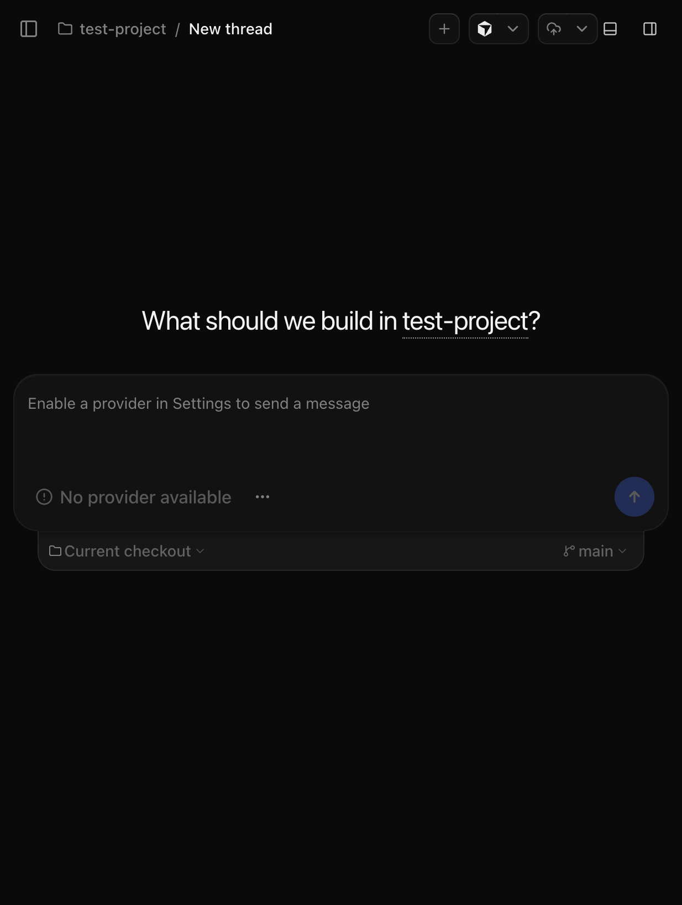
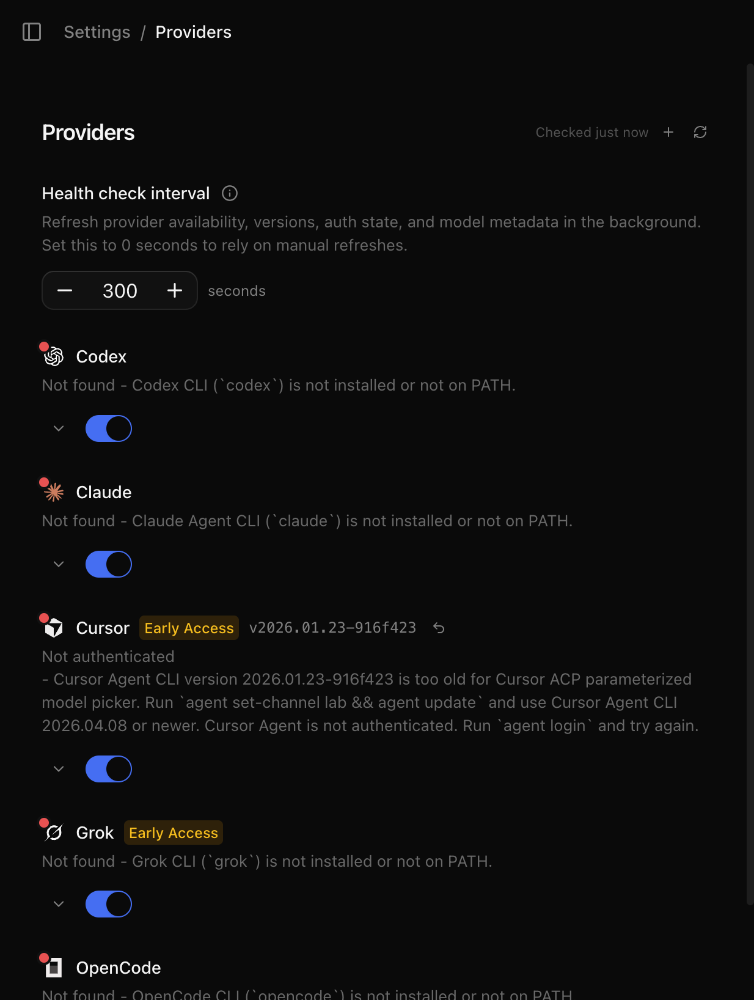

# T3 Code (pingdotgg/t3code) 调研评估报告

- **调研日期**: 2026-08-24
- **仓库**: https://github.com/pingdotgg/t3code (MIT License, 20k+ stars)
- **调研方式**: 本地克隆 + `npx t3@latest` 实际编译运行 + 源码架构分析 + 浏览器实测
- **调研环境**: macOS, Node v25.2.1, pnpm 10.26.0, 隔离测试目录 `/tmp/t3code-research`（未污染 GetFanSee 工作目录）

---

## 一、执行摘要

| 问题                                      | 结论                                                                                                                                                                                       |
| ----------------------------------------- | ------------------------------------------------------------------------------------------------------------------------------------------------------------------------------------------ |
| **是否推荐直接集成到 GetFanSee 工作流？** | **不推荐**（现阶段）                                                                                                                                                                       |
| **是否有值得借鉴的架构/工程实践？**       | **是**，见第五节                                                                                                                                                                           |
| **最大价值点**                            | Git worktree 生命周期管理模式；Provider 健康检查/版本门禁模式；ACP 协议标准                                                                                                                |
| **最大风险点**                            | Cursor 支持仍是 "Early Access" 且默认禁用，对 CLI 版本要求严格（需 2026.04.08+，当前环境为 2026.01.23）；不理解 GetFanSee 自定义的 12+ chief-agent 体系；移动端能力依赖第三方云 relay 服务 |

**一句话结论**：T3 Code 是一个做工精良的开源"多 AI-CLI 编排壳"（本质是给 Codex/Claude/Cursor/Grok/OpenCode 的 CLI 套一层带 Web/移动端 UI 的进程管理器），但它编排的粒度是"哪个 CLI 提供商在跑"，而不是 GetFanSee 已经在用的"哪个业务领域 agent（chief-frontend-architect 等）在跑"。它不能替代或增强 GetFanSee 现有的 `.cursor/rules` + `.cursor/agents` + hooks 体系，直接采用的收益低于运维/安全成本。但其中几个子系统的设计模式值得抽取复用。

---

## 二、项目背景

T3 Code 官方定位为 "agent harness control surface"：通过 iOS/Android App、Web App、Electron 桌面应用远程控制本机运行的 AI 编程 CLI（Codex、Claude Code、**Cursor**、Grok Build、OpenCode）。

- **License**: MIT（`apps/server/package.json` 确认），可自由学习、复制、修改代码
- **技术栈**: TypeScript + Effect-TS（函数式编程库，贯穿整个后端）、React（Web）、Electron（桌面）、React Native（移动端，`apps/mobile`）
- **Monorepo 结构**:
  ```
  apps/
    desktop/    Electron 壳
    marketing/  Astro 官网
    mobile/     React Native App
    server/     核心编排后端（重点分析对象）
    web/        Web 控制台（React SPA）
  packages/
    client-runtime/            前端-后端共享运行时
    contracts/                 API/事件契约（Effect Schema）
    effect-acp/                Agent Client Protocol 的 Effect 实现
    effect-codex-app-server/   Codex 专用协议适配
    shared/                    公共工具
    ssh/                       SSH 隧道（远程访问）
    tailscale/                 Tailscale Serve 集成（远程访问）
  ```

---

## 三、本地编译与运行实测

### 3.1 环境检查结果

| 依赖                                          | 要求                                            | 本机实际                                      | 结果                                              |
| --------------------------------------------- | ----------------------------------------------- | --------------------------------------------- | ------------------------------------------------- |
| Node.js（根 monorepo, `vp`/`vite-plus` 构建） | `^24.13.1`（精确匹配）                          | v25.2.1                                       | ⚠️ 略超范围，未实测完整 monorepo 构建             |
| Node.js（`apps/server` 独立运行时）           | `^22.16 \|\| ^23.11 \|\| >=24.10`               | v25.2.1                                       | ✅ 兼容                                           |
| pnpm                                          | `pnpm@11.10.0`（`packageManager` 字段精确匹配） | 10.26.0                                       | ⚠️ 版本不一致（`corepack` 未安装，未强制）        |
| Rust/Cargo（`resource-monitor` 原生组件）     | 需要                                            | 未安装                                        | ⏭️ 跳过（非核心功能，已在计划中标注为可忽略风险） |
| Cursor Agent CLI (`cursor-agent`/`agent`)     | Early Access 需 ≥2026.04.08（lab 频道）         | 2026.01.23-916f423（stable 频道），**未登录** | ⚠️ 版本过旧 + 未认证                              |

### 3.2 运行方式：选择 `npx t3@latest`（免编译）

考虑到根 monorepo 构建工具链（`vp`/Vite+）依赖精确 Node/pnpm 版本、且 Rust 组件不可用，按计划风险预案，采用 **"快速体验"路径**而非完整 `vp i && vp run build`：

```bash
npx --yes t3@latest serve --port 5199 --host 127.0.0.1 \
  --auto-bootstrap-project-from-cwd --log-level info
```

**结果：一次性成功启动**（exit code 0），未做任何降级 Node 版本等额外处理：

```
[INFO] Migrations ran successfully （40 个 SQLite 迁移文件，event-sourcing 架构）
[WARN] Claude Agent CLI health check failed. { errorTag: 'PlatformError' }
[WARN] Grok CLI health check failed. { errorTag: 'PlatformError' }
[INFO] Listening on http://127.0.0.1:5199
T3 Code server is ready.
Pairing URL: http://127.0.0.1:5199/pair#token=***
```

服务器自带一个基于 SQLite 的持久化层（40 个迁移，命名如 `OrchestrationEvents`、`ProjectionThreads` 等，是标准的 **事件溯源（Event Sourcing）+ 投影（CQRS）** 架构）。

### 3.3 Web 控制台实测（浏览器自动化验证）

| 步骤                                             | 结果                                                                  | 证据                                                    |
| ------------------------------------------------ | --------------------------------------------------------------------- | ------------------------------------------------------- |
| 用 Pairing Token 配对                            | ✅ 成功                                                               | 跳转到 "What should we work on?" 首页                   |
| 添加本地项目（内置文件浏览器，非原生 OS 对话框） | ✅ 成功                                                               | 输入路径 `/tmp/t3code-research/test-project` 后创建项目 |
| 新建 Thread 界面                                 | ✅ 加载正常，显示 git 分支选择器（`main`）、"Current checkout" 切换器 | 见下方截图                                              |
| **发送消息给 Cursor Agent**                      | ❌ **未能测试**                                                       | Composer 显示 "No provider available"（按钮禁用）       |



**关键发现 — Cursor Provider 状态**（`Settings → Providers` 页面实测）：

- Cursor 默认 **禁用**，标记为 **"Early Access"**（与 Codex/Claude/OpenCode 默认启用不同）
- 手动启用后，状态显示：

  > **Not authenticated** — Cursor Agent CLI version 2026.01.23-916f423 is too old for Cursor ACP parameterized model picker. Run `agent set-channel lab && agent update` and use Cursor Agent CLI 2026.04.08 or newer. Cursor Agent is not authenticated. Run `agent login` and try again.

  

- **本次调研未执行 `agent update` / `agent login`**：这两个操作会分别升级用户机器上全局安装的 `cursor-agent` 二进制（影响其他项目/日常使用的 Cursor CLI 版本）、以及用个人账号完成 OAuth 登录。这超出了"只读调研"的安全边界，因此未执行，仅记录该限制。

- **其他所有 provider**（Codex、Claude、Grok、OpenCode）均显示 "Not found"（本机未安装对应 CLI），因此**本次调研未能实际测试任何一个 provider 的端到端对话/编码交互**，也无法测试"阶段 3.3 多 Agent 并发场景"的 UI 行为。多 Agent 能力改为通过源码分析验证（见第四节）。

---

## 四、架构与代码分析

### 4.1 Provider 编排层（`apps/server/src/provider/`）

采用清晰的 Driver/Adapter 模式（源码：`apps/server/src/provider/Drivers/CursorDriver.ts` 第 12-187 行）：

```typescript
export const CursorDriver: ProviderDriver<CursorSettings, CursorDriverEnv> = {
  driverKind: DRIVER_KIND,
  metadata: {
    displayName: "Cursor",
    supportsMultipleInstances: true,
  },
  // ...
```

- `supportsMultipleInstances: true` → **确认支持同一 provider 类型的多实例并发**（例如可以同时配置多个 Cursor 实例，各自独立的 `snapshot`/`adapter`/`textGeneration` 闭包，互不干扰）。
- Cursor 集成实际是 spawn 子进程 `cursor-agent acp`（ACP = **Agent Client Protocol**，Zed 编辑器提出的开放 stdio JSON-RPC 协议），而非直接调用私有 API（源码：`apps/server/src/provider/acp/CursorAcpSupport.ts` 第 33-47 行）：

```typescript
export function buildCursorAcpSpawnInput(
  cursorSettings: CursorAcpRuntimeCursorSettings | null | undefined,
  cwd: string,
  environment?: NodeJS.ProcessEnv
): AcpSessionRuntime.AcpSpawnInput {
  return {
    command: cursorSettings?.binaryPath || "cursor-agent",
    args: [
      ...(cursorSettings?.apiEndpoint ? (["-e", cursorSettings.apiEndpoint] as const) : []),
      "acp",
    ],
    cwd,
    // ...
  };
}
```

**含义**：T3 Code 对 Cursor 的支持本质上等价于"帮你在指定目录跑一个 `cursor-agent acp` 子进程，再把它的 stdio JSON-RPC 流转换成 Web/移动端可消费的事件"。它**不会**、也**无法**读取或理解 GetFanSee 仓库内 `.cursor/agents/*.md`、`.cursor/rules/*.mdc` 定义的 12 个业务领域 chief-agent —— 这些是 Cursor CLI/IDE 自身加载的规则文件，T3 Code 只是黑盒调用 `cursor-agent` 二进制，看不到、也不需要看到这层。

### 4.2 Git / Worktree 生命周期管理（`apps/server/src/git/GitWorkflowService.ts`）

源码第 65-89 行：

```typescript
readonly createWorktree: (
  input: VcsCreateWorktreeInput,
) => Effect.Effect<VcsCreateWorktreeResult, GitCommandError>;
// ...
readonly removeWorktree: (
  input: VcsRemoveWorktreeInput,
) => Effect.Effect<void, GitCommandError>;
readonly pruneWorktrees: (input: {
  readonly cwd: string;
}) => Effect.Effect<void, GitCommandError>;
```

官方文档（`docs/user/permission-modes.md`）明确建议：

> Use **Full access** for work in a **worktree** or a sandbox you can throw away.

**这与 GetFanSee 的 [`parallel-agent-coordination.mdc`](../../.cursor/rules/parallel-agent-coordination.mdc) 理念高度一致**（"one isolated worktree per agent → own branch → PR merge"）。但深入代码发现，`createWorktree`/`removeWorktree` 的实际调用场景主要围绕 **PR 审查 checkout 复用**（`GitManager.ts` 中的 `preparePullRequestThread`/`reuseExistingWorktree`），代码注释里写道（第 2035 行）：

```typescript
// Only when the checkout actually moved: another thread may be running in this worktree,
```

即 T3 Code **意识到**多个 thread 可能共享同一 worktree 需要小心处理，但**没有发现**"每创建一个新 thread 就自动分配一个隔离 worktree"的默认强制行为——UI 上 "Current checkout" 下拉菜单说明这是**用户手动选择**的能力，而非自动化调度。也就是说，即使采用 T3 Code，仍需要人工遵守"一 agent 一 worktree"的纪律，工具本身不会像 GetFanSee 现有的 `.cursor/hooks/check-file-ownership.py` 那样做**强制拦截**。

### 4.3 事件溯源架构（`apps/server/src/orchestration/`, `persistence/`）

- `decider.ts` / `projector.ts`：标准的 CQRS Decider 模式（命令 → 事件 → 投影）
- 40 个 SQLite migrations，命名规范（`OrchestrationEvents`, `ProjectionThreads`, `AuthAccessManagement` 等）
- 这是一套成熟的、可审计的状态管理架构，**对 GetFanSee 当前阶段可能属于过度设计**，但如果未来需要构建"多 agent 任务追踪看板"，此模式值得参考。

### 4.4 移动端推送通知机制（`apps/server/src/relay/AgentAwarenessRelay.ts`）

初步以为这是"多 agent 互相感知"的协调机制，实测代码后发现其真实用途是**将 agent 会话状态（running/completed/failed）推送到 T3 官方云端 relay 服务，再由云端转发 APNs/FCM 推送通知到手机 App**（源码：`apps/server/src/relay/AgentAwarenessRelay.ts` 第 294-335 行）：

```typescript
const make = Effect.gen(function* () {
  const secrets = yield* ServerSecretStore.ServerSecretStore;
  // ...
  const readRelayConfig = Effect.gen(function* () {
    const [url, issuer, environmentCredential] = yield* Effect.all([
      readSecretString(RELAY_URL_SECRET),
      // ...
```

**关键风险点**：此功能依赖 **"T3 Connect"云端账号链接**（`RELAY_URL_SECRET`、`RELAY_ENVIRONMENT_CREDENTIAL_SECRET` 等云端凭证），本地 headless 模式下默认处于 "waiting-for-link" 待机状态。这意味着移动端远程通知/控制并非纯本地功能，而是要经过第三方（T3 Tools Inc.）的云端中转服务器。对于 GetFanSee 这样处理支付、KYC、创作者内容的平台，引入額外的第三方云端中转，需要经过 `chief-security-architect`/`chief-legal-compliance-advisor` 的合规评估，不能默认视为安全。

### 4.5 MCP / SSH / Tailscale 支持

- `apps/server/src/mcp/`：实现了 `McpHttpServer.ts`、`McpSessionRegistry.ts` —— T3 Code 本身可作为 **MCP Server** 被其他工具调用，也管理 provider 会话中的 MCP 工具调用
- `packages/ssh/`、`packages/tailscale/`：提供两种远程访问通道（SSH 隧道 / Tailscale Serve HTTPS），供移动端跨网络连接本机服务器

---

## 五、GetFanSee 集成可行性评估

### 5.1 直接使用：不推荐（现阶段）

| 维度                                                          | 结论                                                                                                                |
| ------------------------------------------------------------- | ------------------------------------------------------------------------------------------------------------------- |
| 能否识别 GetFanSee 的 `.cursor/agents/*.md` 12 个业务 agent   | ❌ 不能。T3 Code 只把 Cursor 当作黑盒 CLI provider，编排粒度停留在"provider 层"，不理解 GetFanSee 的业务 agent 分工 |
| 能否与 `.cursor/hooks.json` 协同                              | ✅ 不冲突（hooks 由 `cursor-agent` 自身触发，与谁 spawn 它无关）                                                    |
| 能否自动强制执行 `parallel-agent-coordination.mdc` 的隔离规则 | ⚠️ 部分——提供了 worktree 操作能力，但需人工选择，不像现有 hooks 一样强制拦截                                        |
| Cursor 支持成熟度                                             | ❌ Early Access，默认禁用，需要 lab 频道最新版 CLI + 手动登录，当前实测环境无法完整跑通                             |
| 额外运维成本                                                  | 需要常驻后端进程 + SQLite 数据库 + （可选）连接第三方云 relay                                                       |
| 许可证/合规                                                   | MIT 开源代码本身没问题；但移动端推送功能依赖官方云服务，需额外合规评估                                              |

**结论**：投入产出比不划算。GetFanSee 已经有一套更贴合自身需求、经过实战打磨的 Cursor 原生方案（`.cursor/rules` + `.cursor/agents` + `hooks.json` + `agent-locks.json`），T3 Code 无法替代或增强这套体系的核心价值（多业务 agent 协作、文件所有权锁、release gate 强制），只是多了一层"跑 cursor-agent 的壳 + 移动端 UI"。

### 5.2 架构借鉴：有一定价值

可以低成本移植到 GetFanSee 的具体模式（不需要引入整个 T3 Code）：

1. **Worktree 生命周期脚本化**
   GetFanSee 当前 `parallel-agent-coordination.mdc` 要求"一 agent 一 worktree"但依赖人工手动 `git worktree add`。可参考 `GitWorkflowService.createWorktree/removeWorktree/pruneWorktrees` 的接口设计，写一个轻量脚本（如 `scripts/agent/worktree.sh create <owner-label> <branch>` / `cleanup`），降低人工出错率，并可选与 `.cursor/agent-locks.json` 联动自动登记 claim。

2. **Provider/环境健康自检模式**
   `ProviderDriver.checkProvider` + UI 上清晰的"未安装/版本过旧/未认证 + 具体修复命令"提示，是很好的 UX 范式。可借鉴思路，在 GetFanSee 的 `pnpm check-all` 或新增 `pnpm check:agent-env` 中加入"Cursor CLI / gh CLI / Supabase CLI 是否就绪"的自检步骤，并输出可执行的修复命令，而不仅仅是失败退出码。

3. **ACP（Agent Client Protocol）作为未来自建监控面板的技术选型**
   如果 GetFanSee 未来想要一个轻量级"本机正在运行哪些 cursor-agent 会话"的监控视图（辅助人工确认 `parallel-agent-coordination` 是否被遵守），可以直接对接 Cursor CLI 暴露的 `cursor-agent acp` 标准协议（`packages/effect-acp` 提供了可参考的 TypeScript 实现），而不必引入 T3 Code 整个产品（含移动端、云 relay、Electron 打包等不需要的部分）。这是一条更精简、风险更低的路径。

### 5.3 观察跟进项

- 待 Cursor ACP 支持从 "Early Access" 转为正式版（版本门禁放宽、默认启用）后，可重新评估其移动端远程监控/审批能力对"出差场景下检查 CI 状态、批准某个 agent 操作"是否有实际价值。
- 关注 T3 Code 是否会推出"自定义 provider/business-agent 层"的扩展点（目前架构上是 provider = CLI 工具，而非业务角色），如果未来支持，可重新评估其对 GetFanSee 多 chief-agent 体系的编排价值。

---

## 六、结论与建议行动

1. **不建议**将 T3 Code 引入 GetFanSee 的日常开发工具链或 CI/CD 流程。
2. **建议**：如果团队中有人对"移动端远程查看/控制本机 Cursor 会话"有强烈个人需求，可作为**个人生产力工具**在隔离环境自行尝试（MIT 协议、`npx t3@latest` 零安装即可试用），但不建议作为团队标准工具，也不应让其接触包含 GetFanSee 生产密钥的 `.env.local` 环境。
3. **建议低成本借鉴**：worktree 生命周期脚本化（5.2.1）+ agent 环境自检模式（5.2.2），可作为后续 `chief-reliability-architect` 或 `chief-ai-automation-architect` 的小任务纳入 `docs/planning/sprint-current.md`。
4. 本次调研未修改 GetFanSee 仓库任何文件，未安装任何全局工具变更（未执行 `agent update`/`agent login`），所有测试均在 `/tmp/t3code-research` 隔离目录完成，测试服务器已停止清理。

---

## 附：本次调研执行记录

- 克隆命令：`git clone --depth 1 https://github.com/pingdotgg/t3code.git`（隔离于 `/tmp/t3code-research/t3code`）
- 运行命令：`npx --yes t3@latest serve --port 5199 --host 127.0.0.1 --auto-bootstrap-project-from-cwd`（exit code 0，一次成功）
- 浏览器实测：配对 → 添加本地测试项目 → 新建 Thread → Settings/Providers 检查 5 个 provider 状态
- 未执行的高风险操作（已说明原因）：`vp i && vp run build`（完整 monorepo 构建，因 Node/pnpm 版本及 Rust 工具链限制未验证）、`agent update`、`agent login`
- 环境清理：已 `kill` 测试服务器进程，释放 5199 端口；`/tmp/t3code-research` 为临时目录，不影响 GetFanSee 仓库
